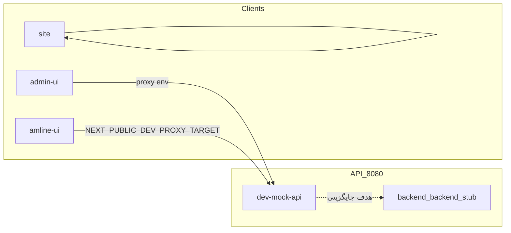

# املاین — Master Specification v5.0

> ضمیمهٔ Enterprise Master نهایی: [`AMLINE_ENTERPRISE_MASTER_v5.0.md`](./AMLINE_ENTERPRISE_MASTER_v5.0.md)

**وضعیت:** منبع اصلی حقیقت اجرایی برای هم‌ترازی تیم با **کد GitHub** و **معماری/محصول هدف**  
**تاریخ نگارش:** ۲۰۲۶-۰۴-۰۳ — **v5.0:** پشتهٔ **Observability** (Tempo، Grafana provisionشده، Loki، Promtail، Prometheus scrape بک‌اند + ml-pricing)؛ **Metabase** با SQL نمونه در `integrations/metabase/sql/`؛ **n8n** pipeline لید→ویزیت→قرارداد؛ **Thumbor** امضا + preset و API presets؛ **ML pricing** متریک `/metrics`، baseline قابل آموزش، retry در `CompositePricingEngine`؛ **چند آژانس** (`AMLINE_AGENCY_SCOPE_ENABLED`، `GET /api/v1/meta/context`، هدر `X-Agency-Id`، UI تنظیمات ادمین)؛ **Billing** در ادمین `/billing` و کاربر `amline-ui/billing`؛ **Temporal** workflow فعال با activity؛ **Matrix** مستند E2EE + Synapse در compose؛ **پیشنهاد آگهی** CF مبتنی بر `ratings`. **v3.1:** P0#1 — `/api/v1/*` + mount legacy. **v3.2:** P0#2 — حذف جنگو از مسیر فعال؛ **Listing** با SQLAlchemy + Alembic + CRUD تحت `/api/v1/listings` (+ mount legacy `/listings`). **v3.3:** P0#3 — **OTP پیامکی + امضا/شاهد** در `backend/backend` (حافظه + آداپتور SMS mock/کاوه‌نگار placeholder). **v3.4:** P0#4 — **`ErrorResponse` یکدست** + هندلر سراسری در `backend/backend` و **`dev-mock-api`**. **v3.5:** **P1 — ماژول‌های پلتفرم** در `backend/backend`: CRM پایگاه‌داده، بازدید، کیف‌پول/ledger، پرداخت (mock PSP + callback + idempotency)، صف حقوقی، رجیستری mock، نوتیفیکیشن (SMS)، استان/شهر (seed واقعی نمونه)، RBAC + ممیزی DB، لاگ ساخت‌یافته HTTP، health/metrics. **v3.6:** **P2 — Growth Layer** در `backend/backend`: نیازمندی املاک (`property_requirements`)، موتور تطبیق rule-based (آمادهٔ جایگزینی ML)، تخمین قیمت rule-based، چت + جدول پیام + WebSocket، امتیازدهی و تجمیع، موبایل (cursor + متادیتا + push placeholder)، جستجوی متنی (SQLite ILIKE + آمادهٔ Postgres)، آنالیتیکس رویداد، فید/سایت‌مپ/متا SEO عمومی. **v3.7:** مهاجرت فرانت به **`backend/backend`** (پروکسی `/api/v1`، کلاینت خطا، CRM v1، Playwright روی بک‌اند واقعی + `run_e2e_server.py`)؛ دادهٔ جغرافی ایران (JSON + `seed_iran_geo` + کش TTL روی geo)؛ لید CRM با **`province_id` / `city_id`** اختیاری. **v3.8:** عملیات — هدرهای امنیتی، CORS از env، شمارندهٔ Prometheus اختیاری (`/metrics`)، rate limit داخلی OTP؛ اسکریپت بار **`scripts/load/k6-smoke.js`**؛ CI بک‌اند با **`pip` + `requirements.txt`** (هم‌خوان با درخت فعلی). **`dev-mock-api`** صرفاً fallback توسعه. **v3.9:** **لایهٔ پس از لانچ (اسکلت محصول)** — دعوت بتا + آنبوردینگ + تیکت پشتیبانی + پلن/اشتراک + KPI داشبورد + پیشنهاد آگهی (rule stub) + ingest خطای کلاینت + وضعیت هشدار؛ آداپترهای **PSP** (`zarinpal`/`idpay`/`nextpay`/`mock` از `AMLINE_PSP_PROVIDER`)؛ **SMS** (`ghasedak` + زنجیرهٔ fallback اختیاری)؛ **ML registry** (`GET /api/v1/ai/ml/status`)؛ **i18n** middleware + `GET /api/v1/i18n/bundle`؛ **جستجو** با `search_document` + **GIN tsvector** روی Postgres؛ مدل‌های **`agencies`/`regions`** و فیلدهای **`agency_id`** روی listing/lead؛ **gamification** جدول امتیاز؛ migration **`f0e1d2c3b4a5_*`**. UI تاریک/تم سفارشی و گیمیفیکیشن پیشرفته در فرانت هنوز سطح «راهنما/کلاینت» است. **Legacy** `/admin/crm/*` بدون تغییر. **v4.0:** **PSP پروداکشن** — زرین‌پال/آیدی‌پی/نکست‌پی با REST واقعی، callback اختصاصی + verify سرور، فیلدهای `psp_provider`/`psp_checkout_token`، ضدجعل و IP اختیاری، `verify-retry`، ادمین `/payments`، migration **`a1b2c3d4e5f7_*`**، [`PSP_INTEGRATION.md`](./PSP_INTEGRATION.md). **v4.1:** **یکپارچه‌سازی سازمانی** — Meilisearch (شاخهٔ جستجو، sync پس از CRUD آگهی، reindex ادمین)، PostHog (capture سرور همراه ingest آنالیتیکس؛ کلاینت ادمین اختیاری)، پروکسی Nominatim روی `/api/v1/geo/nominatim/*`، MapLibre + خوشهٔ مارکر در `admin-ui`، وب‌هوک n8n برای لید/ویزیت/شروع قرارداد، Thumbor، قیمت‌گذاری ترکیبی (`CompositePricingEngine` + `AMLINE_ML_PRICING_URL`)، OpenTelemetry در `main.py`، هوک اسکلت Temporal، مسیرهای `/api/v1/integrations/*`، پروفایل Docker `integrations` (Meilisearch، n8n، Thumbor، Metabase، OTLP collector)، [`INTEGRATIONS.md`](./INTEGRATIONS.md)، تست `test_integrations_geo.py`؛ مختصات `latitude`/`longitude` روی listing.  
**ریپوی مرجع کد:** [Amline_namAvaran](https://github.com/m-khonyagar/Amline_namAvaran)  
**یکپارچگی فرانت (SSOT):** [`FRONTEND_API_INTEGRATION.md`](./FRONTEND_API_INTEGRATION.md) و فهرست ماشین‌خوان مسیرها `docs/generated/frontend-http-inventory.json`.  
**معماری پروداکشن قراردادمحور (هدف: شکست، اختلاف، تسویه، ممیزی حقوقی، SLA، نسخه‌گذاری):** [`ARCHITECTURE_CONTRACT_PLATFORM_PRODUCTION.md`](./ARCHITECTURE_CONTRACT_PLATFORM_PRODUCTION.md).  
**سند محصول واحد قراردادهای چندگانه (v2.0 — شش نوع قرارداد، فلو امضا/پرداخت، Strangler):** [`Amline_Complete_Master_Spec_v2.md`](./Amline_Complete_Master_Spec_v2.md) — پیوست‌های اجرایی: [`CONTRACT_DATA_MODELS.md`](./CONTRACT_DATA_MODELS.md)، [`CONTRACT_SERVICE_API_SPEC.md`](./CONTRACT_SERVICE_API_SPEC.md)، [`SIGNATURE_PAYMENT_SCENARIOS.md`](./SIGNATURE_PAYMENT_SCENARIOS.md)، [`STATUS_MAPPING_v2.md`](./STATUS_MAPPING_v2.md)؛ فلوهای نوع‌محور: [`SALE_CONTRACT_FLOW.md`](./SALE_CONTRACT_FLOW.md)، [`EXCHANGE_CONTRACT_FLOW.md`](./EXCHANGE_CONTRACT_FLOW.md)، [`LEASE_TO_OWN_FLOW.md`](./LEASE_TO_OWN_FLOW.md)، [`CONSTRUCTION_CONTRACT_FLOW.md`](./CONSTRUCTION_CONTRACT_FLOW.md)، [`PRE_SALE_CONTRACT_FLOW.md`](./PRE_SALE_CONTRACT_FLOW.md).  
**تحلیل as-built بر اساس:** snapshot معادل `main` (مسیر نمونه workspace: `dev-mock-api/main.py`, `admin-ui`, `amline-ui`, `backend/backend`)

---

## 0. نقشهٔ سند و مخاطبان

| بخش | مخاطب اصلی | کاربرد |
|-----|-------------|--------|
| §1–3 تعریف SSOT و وضعیت پیاده‌سازی | PM، Tech Lead | اولویت‌بندی نقشهٔ راه |
| §4 معماری و §5 فنی | Dev، DevOps | اجرا، env، CI |
| §6 مدل داده | Backend، DBA | قرارداد داده |
| §7 API (هدف + as-built) | Backend، فرانت، QA | تست و قرارداد |
| §8 جریان UX و نگاشت UI | Design، فرانت، QA | سناریو و پوشش |
| §9–12 لبه‌ها، خطا، امنیت، عملیات | Security، DevOps، QA | چک‌لیست تحویل |
| پیوست الف کاتالوگ mock | همه | مرجع دقیق مسیرها |
| پیوست ب ماتریس گپ | Tech Lead | مهاجرت و پر کردن نقص |
| پیوست ج مرجع عمیق | همه | لینک به سند تاریخی |

**سند عمیق محصول/دامنه (Target) بدون حذف:** [AMLINE_REFERENCE_V2_2.md](./AMLINE_REFERENCE_V2_2.md) (v2.7) — شامل §0–§36، Blu، DDD، STRIDE، SLO، و ۴۰+ `error.code`. این Master آن محتوا را **جایگزین نمی‌کند**؛ آن را **خلاصه، برچسب‌گذاری و با کد هم‌تراز** می‌کند.

---

## 1. دو لایهٔ حقیقت (الزام تفکیک)

| لایه | معنا | منبع |
|------|------|------|
| **Target** | قرارداد نهایی محصول و API (`/api/v1`، `ErrorResponse`، ledger، بازدید، چندآژانس، …) | `AMLINE_REFERENCE_V2_2.md` + `openapi/amline-v1-errors.openapi.yaml` |
| **As-built** | آنچه در ریپوی فعلی قابل اجراست | `backend/backend` (FastAPI + DB + `/api/v1`)، `dev-mock-api` (fallback در حافظه)، اپ‌های فرانت |

**قاعده:** اگر Target و As-built اختلاف دارند، در PR و تست باید صریحاً مشخص شود کدام لایه معیار است؛ برای پروداکشن، **Target** غالب است مگر تصمیم کتبی نقض شود.

---

## 2. Product Spec (خلاصهٔ هدف + وضعیت)

### 2.1. چشم‌انداز

پلتفرم املاک و **قرارداد آنلاین** با لایهٔ مشاور، مصرف‌کننده، و بک‌آفیس؛ **امضای معتبر فاز ۱–۲ فقط OTP پیامکی** (جزئیات و ممنوعیت‌ها در مرجع §2.4).

### 2.2. جدول وضعیت پیاده‌سازی (High level)

| قابلیت (Target) | As-built mock | `backend/backend` | یادداشت |
|-----------------|---------------|-------------------|---------|
| ورود ادمین + OTP | شبیه‌سازی (`/admin/otp/send`, `/admin/login`) | خیر | توکن ثابت mock |
| RBAC نقش/مجوز | لیست نقش‌ها + CRUD در حافظه | خیر | permissions string |
| CRM لید + فعالیت | کامل در mock | خیر | بدون listing/requirement/visit |
| ویزارد قرارداد چندمرحله | API گسترده + `step` + **خطای یکدست (P0#4)** | همان routeهای قرارداد + **OTP/امضا واقعی در حافظه** (P0#3) + **خطای یکدست (P0#4)** | فرانت: ترجیحاً `error.code`؛ فیلد legacy `detail` نیز برای سازگاری پر می‌شود |
| فایل/آگهی شبکه‌ای/عمومی | فقط `POST /files/upload` پوسته | **CRUD آگهی در DB** (`/api/v1/listings`) + `visibility`؛ اتصال فایل→آگهی هنوز ناقص | §3.1 مرجع؛ `inventory_file_id` اختیاری |
| نیازمندی، بازدید، SLA | mock سبک | **بازدید + CRM DB + SLA روی لید** (`/api/v1/visits`، `/api/v1/crm/*`) | موجودیت requirement جدا هنوز Target |
| کیف‌پول / ledger | `GET /financials/wallets` → **تراز از ledger** | **ledger جدول + تراز مشتق** (`/api/v1/wallets/...`) | PSP واقعی / چندارزی |
| پرداخت / PSP / webhook | خیر | **Intent + callback درگاه + verify REST** (زرین‌پال/آیدی‌پی/نکست‌پی/موک) + idempotency ledger + ادمین لاگ | IP allowlist / کلیدها در env عملیاتی |
| رسمی‌سازی / registry worker | خیر | خیر | Target |
| ممیزی / جلسه / متریک / نوتیف | mock | خیر | مناسب dev ادمین |
| استان/شهر | endpoint خالی `[]` | **بله** — `/api/v1/geo/*` + seed + کش | دادهٔ `iran_geo.json` + Alembic |

---

## 3. Architecture Spec

### 3.1. ساختار monorepo (as-built)

```
admin-ui/          React 18 + Vite + React Router — پورت 3002
amline-ui/         Next.js 14 App Router — پورت 3000
site/              Next.js 15 static — پورت 3001
dev-mock-api/      FastAPI — پورت 8080 (توسعه بدون DB)
backend/backend/   FastAPI + `requirements.txt` / pip — پورت 8080 (پروداکشن-محور)
pdf-generator/     FastAPI
seo-dashboard/     Next.js
packages/amline-ui-core/  کامپوننت/تم مشترک (button, card, theme tokens, errors helper)
```

### 3.2. جریان دادهٔ توسعه



- **توسعه رایج:** فرانت به `dev-mock-api` روی 8080 متصل می‌شود (README ریپو).
- **پروداکشن هدف:** `backend/backend` + Postgres/Redis/MinIO (docker-compose ریپو).

### 3.3. CI/CD (GitHub Actions)

Workflowهای موجود در `.github/workflows/` (نمونه): `ci.yml` (backend tests با Postgres سرویس، lint، mypy، pytest، build Docker)، `repo-hygiene.yml`، `deploy-seo-agent.yml`، `deploy-super-agent-parmin.yml`، `super-agent-ci.yml`، `admin-ui-property-tests.yml`.  
**توجه:** CI انتظار دارد `backend/backend` تست‌پذیر باشد؛ وضعیت فعلی کد اپلیکیشن در `main.py` بسیار محدود است — هماهنگی تست‌ها با اسکلت واقعی باید در بک‌لاگ مهاجرت بماند.

---

## 4. Technical Spec

### 4.1. Stack اصلی

| جزء | فناوری | نسخهٔ نمونه (package.json) |
|-----|--------|------------------------------|
| admin-ui | React, Vite, TanStack Query, axios, zod, tailwind | react ^18.3 |
| amline-ui | Next 14, TanStack Query, axios, zod | next 14.2.5 |
| mock API | FastAPI, Pydantic, uvicorn | fastapi در requirements |
| backend API | FastAPI, SQLAlchemy 2, Alembic | `requirements.txt` در `backend/backend` |

### 4.2. متغیرهای محیطی (از README ریپو)

**admin-ui `.env.local`:** `VITE_USE_MSW`, `VITE_ENABLE_DEV_BYPASS`, `VITE_DEV_PROXY_TARGET`, `VITE_API_URL`, `VITE_USE_CRM_API`  
**amline-ui `.env.local`:** `NEXT_PUBLIC_DEV_PROXY_TARGET`, `NEXT_PUBLIC_ENABLE_DEV_BYPASS`  
**backend `backend/backend`:** `DATABASE_URL` (پیش‌فرض dev: `sqlite:///./data/amline.db`)؛ پس از clone: `alembic upgrade head`.  
**OTP / SMS (P0#3):** `AMLINE_SMS_PROVIDER` (`mock` \| `kavenegar`)، `KAVENEGAR_API_KEY` (فقط وقتی کاوه‌نگار)، `AMLINE_OTP_TTL_SECONDS`، `AMLINE_OTP_MAX_ATTEMPTS`، `AMLINE_OTP_LOCKOUT_SECONDS`، `AMLINE_OTP_SEND_WINDOW_SECONDS`، `AMLINE_OTP_MAX_SENDS_PER_WINDOW`، `AMLINE_OTP_DEBUG` (فقط dev — **هرگز** در پروداکشن؛ برمی‌گرداند `debug_code` در JSON).  
**P1:** `AMLINE_RBAC_ENFORCE` (`0` پیش‌فرض؛ `1` برای اجبار مجوزها)، `AMLINE_CRM_SLA_HOURS` (پیش‌فرض ۴۸)، `AMLINE_PSP_WEBHOOK_SECRET` (اختیاری؛ در صورت تنظیم، callback نیازمند هدر `X-PSP-Secret`)، `AMLINE_AUDIT_USER_ID` (fallback ممیزی).  
**P2:** `AMLINE_PUBLIC_BASE_URL`، `AMLINE_SITE_NAME`، `AMLINE_SITE_DESCRIPTION` (SEO عمومی)؛ `AMLINE_DEFAULT_USER_ID` (fallback وقتی `X-User-Id` نیست).

### 4.3. CORS

- **dev-mock-api:** فقط originهای localhost 3000–3002.
- **`backend/backend`:** CORS محدود به localhost ۳۰۰۰–۳۰۰۲ (هم‌تراز mock dev) — برای پروداکشن محدودتر شود.

---

## 5. Data Model

### 5.1. Target (خلاصه)

موجودیت‌ها و aggregateها، state machine قرارداد، ledger، سازمان/آژانس — طبق [AMLINE_REFERENCE_V2_2.md](./AMLINE_REFERENCE_V2_2.md) §22–§26 و جریان‌های §3.

### 5.2. As-built — قرارداد در mock

ذخیره در `dict` در حافظه (`contracts[cid]`):

- فیلدها: `id`, `type`, `status`, `step`, `parties` (landlords/tenants lists), `created_at`
- `status` نمونه: `DRAFT` → … → `COMPLETED` (پس از witness verify)
- `step` نمونه: `LANDLORD_INFORMATION`, `TENANT_INFORMATION`, `PLACE_INFORMATION`, `DATING`, `MORTGAGE`, `RENTING`, `SIGNING`, `WITNESS`, `FINISH`
- **P0#3:** رویدادهای ممیزی امضا در `signature_events[]` (نوع، `timestamp`، `ip`، `user_agent`، `party_id`، `phone_masked`، متادیتا). روی هر party پس از تایید OTP: `signed`، `signed_at`، `signature_audit` (شامل `ip`، `user_agent`، `salt`). شاهد: آبجکت `witness` با `verified`، `audit`.

### 5.3. As-built — CRM لید

فیلدهای رکورد: `id`, `full_name`, `mobile`, `need_type`, `status`, `notes`, `assigned_to`, `contract_id`, `created_at`, `updated_at`  
فعالیت‌ها: `crm_activities[lead_id]` → `{ id, type, note, user_id, created_at }`

### 5.4. As-built — backend اپلیکیشن (`backend/backend/app`)

- **`main.py`:** FastAPI با CORS dev؛ **`platform_router`** دو بار mount: پیشوند **`/api/v1`** (canonical) و **`""`** (همان مسیرهای `dev-mock-api` تا proxy فرانت بشکند).
- **`api/v1/`:** `health_routes`, `auth_routes`, `contracts_routes`, `misc_routes`, `admin_routes`, `crm_routes`, **`listings_routes`**, `router.py`.
- **`db/base.py`**, **`db/session.py`:** `Base` مشترک SQLAlchemy 2، `get_db`، `DATABASE_URL`.
- **`models/listing.py`:** جدول **`listings`** — `deal_type` (RENT/SALE/MORTGAGE)، `visibility` (NETWORK/PUBLIC)، `status` (draft/ready_to_publish/published/archived)، `owner_id` رشته (موقت)، `price_amount`/`currency`، `location_summary`، `title`/`description`، `inventory_file_id` اختیاری، timestamps.
- **`repositories/memory/state.py`:** قرارداد/CRM/ادمین in-memory (مثل mock).
- **`repositories/listing_repository.py`:** دسترسی DB برای آگهی.
- **`schemas/v1/payloads.py`**, **`schemas/v1/listings.py`**, **`schemas/v1/signatures.py`:** Pydantic v2.
- **`services/v1/otp_service.py`**, **`services/v1/signature_service.py`:** OTP (نرخ ارسال، قفل پس از تلاش مازاد)، امضا/شاهد + ممیزی.
- **`core/errors.py`:** `AmlineError`، ثبت هندلر سراسری (`HTTPException`، `RequestValidationError`، `Exception`)، middleware `X-Request-Id`.
- **`schemas/v1/errors.py`:** `ErrorResponse`، `ErrorInfo`، `FieldErrorItem` (هم‌تراز OpenAPI).
- **`repositories/v1/otp_repository.py`:** ذخیرهٔ چالش OTP در حافظه (جایگزین Redis/DB در پروداکشن).
- **`adapters/sms/`:** `base.py` (Protocol)، `mock.py` (پیش‌فرض)، `kavenegar.py` (placeholder).
- **`_legacy/django/listing_model_reference.py`:** تنها نسخهٔ تاریخی مدل جنگوی قبلی — **import از اپ ممنوع**.
- **`models/user.py`**, **`models/contract.py`:** قدیمی؛ `contract.py` تک‌خطی — ادغام با `Base` در بک‌لاگ جدا.
- **`alembic/`:** migration اول `listings` (revision `fd5df7bd8644`).

---

## 6. API Spec

### 6.1. هدف (Target)

- پیشوند: **`/api/v1/...`**
- خطا: **`ErrorResponse`** با `error.code` — [openapi/amline-v1-errors.openapi.yaml](./openapi/amline-v1-errors.openapi.yaml)
- نگاشت از mock: جدول در [REPO_SPEC_ALIGNMENT.md](./REPO_SPEC_ALIGNMENT.md) §3

### 6.2. As-built — اصول

- مسیرهای legacy mock: بدون پیشوند `/api/v1` (از طریق mount دوم).
- مسیر canonical: **`/api/v1/...`** شامل آگهی:
  - `GET/POST /api/v1/listings`، `GET/PATCH /api/v1/listings/{id}`، `POST /api/v1/listings/{id}/archive` (فیلترهای `visibility`، `status` روی لیست).
- همان مجموعه زیر **`/listings`** (legacy mount) برای سازگاری آینده با proxy.
- **قرارداد — امضا/شاهد (P0#3):** علاوه بر مسیرهای سازگار با `admin-ui` (`POST .../sign`، `.../sign/verify`، `.../witness/send-otp`، `.../witness/verify`)، مسیرهای canonical اضافی: `POST .../sign/request`، `POST .../witness/request`. پاسخ درخواست OTP: `ok`، `challenge_id`، `expires_in_seconds`، `masked_phone` (و در صورت `AMLINE_OTP_DEBUG`، `debug_code`).
- **خطا (P0#4):** پاسخ JSON یکدست مطابق [openapi/amline-v1-errors.openapi.yaml](./openapi/amline-v1-errors.openapi.yaml) و enum §27.4 مرجع عمیق — بدنهٔ اصلی:
  - `error`: `{ "code", "message", "details"?, "request_id" }`
  - `request_id` (تکرار سطح بالا برای ردیابی)
  - `field_errors` (فقط در ۴۲۲ اعتبارسنجی Pydantic)
  - **`detail`:** برای سازگاری با کلاینتهای قدیمی: رشته (خطاهای دامنه) یا آرایهٔ همان `errors` خام FastAPI (۴۲۲).
- **پیوست الف** فهرست کامل متد/مسیر mock (بدون listings قدیمی؛ listings فقط بک‌اند DB).

### 6.3. نمونهٔ خطا (۴۰۴ قرارداد)

```json
{
  "error": {
    "code": "CONTRACT_NOT_FOUND",
    "message": "قرارداد یافت نشد.",
    "details": { "contract_id": "contract-xyz" },
    "request_id": "550e8400-e29b-41d4-a716-446655440000"
  },
  "request_id": "550e8400-e29b-41d4-a716-446655440000",
  "detail": "قرارداد یافت نشد."
}
```

### 6.4. نمونهٔ خطا (۴۲۲ اعتبارسنجی)

```json
{
  "error": {
    "code": "VALIDATION_FAILED",
    "message": "اطلاعات ارسال‌شده معتبر نیست.",
    "request_id": "..."
  },
  "request_id": "...",
  "field_errors": [
    { "field": "name", "code": "missing", "message": "Field required" }
  ],
  "detail": [ { "type": "missing", "loc": ["body", "name"], "msg": "Field required" } ]
}
```

(`detail` در ۴۲۲ همان آرایهٔ خام `errors` از Pydantic/FastAPI است.)

---

## 7. UX Flow و نگاشت UI

### 7.1. admin-ui — مسیرهای React Router (`App.tsx`)

| مسیر | محتوا |
|------|--------|
| `/login` | ورود |
| `/dashboard` | داشبورد |
| `/users`, `/users/:id` | کاربران |
| `/ads` | آگهی‌ها |
| `/contracts`, `/contracts/:id`, `/contracts/pr-contracts`, `/contracts/wizard` | قراردادها |
| `/wallets` | کیف پول |
| `/settings` | تنظیمات |
| `/admin/roles` | نقش‌ها |
| `/admin/audit` | ممیزی |
| `/admin/activity` | فعالیت کارشناس |
| `/crm`, `/crm/:id` | CRM |

### 7.2. amline-ui — App Router

- `app/page.tsx` — خانه
- `app/login/page.tsx`
- `app/contracts/page.tsx`, `app/contracts/[id]/page.tsx`, `app/contracts/wizard/page.tsx`

### 7.3. جریان‌های هدف ↔ UI

| جریان Target (مرجع §3) | پوشش UI/API as-built |
|--------------------------|------------------------|
| OTP ادمین | UI + mock |
| ویزارد قرارداد | UI + بیشتر endpointهای mock |
| CRM لید | UI + mock کامل |
| فایل تا آگهی با visibility | **ناقص** (آپلود پوسته؛ بدون مدل listing کامل) |
| نیازمندی → بازدید → قرارداد | **بازدید + لید CRM در DB**؛ زنجیرهٔ کامل requirement→visit→contract هنوز ناقص |
| پرداخت / ledger | **ledger + intent پرداخت (mock PSP)** در `/api/v1/...` |

---

## 8. Edge Cases و محدودیت‌های mock

- داده پس از ری‌استارت API پاک می‌شود.
- در **`dev-mock-api`** هنوز امضای OTP سطح نمایشی است؛ در **`backend/backend`** (P0#3) OTP واقعی در حافظه + آداپتور SMS mock اعمال می‌شود — برای پیامک واقعی `AMLINE_SMS_PROVIDER=kavenegar` و پیاده‌سازی کامل آداپتور لازم است.
- `VITE_ENABLE_DEV_BYPASS` / `NEXT_PUBLIC_ENABLE_DEV_BYPASS`: فقط dev؛ نباید در پروداکشن فعال باشد.
- نقش‌های جدید در mock در لیست سراسری `ROLES` append می‌شوند (بدون persistence).

---

## 9. Error Handling

| جنبه | Target | As-built (پس از P0#4) |
|------|--------|------------------------|
| شکل پاسخ | `ErrorResponse` + `error.code` | **`backend/backend`** و **`dev-mock-api`**: همان پوشش + `detail` سازگار |
| کاتالوگ کد | §27.4 مرجع + YAML | کدهای متداوم: `VALIDATION_FAILED`، `RESOURCE_NOT_FOUND`، `CONTRACT_NOT_FOUND`، `OTP_INVALID_OR_EXPIRED`، `OTP_RATE_LIMITED`، `INTERNAL_ERROR`، … |
| 422 اعتبارسنجی | `field_errors` + YAML | `field_errors` ساختاریافته + `detail` آرایهٔ خام FastAPI |
| ردیابی | `request_id` / `X-Request-Id` | تولید UUID در صورت نبود هدر؛ هدر پاسخ برگردانده می‌شود |

**P0#4 انجام شد:** `app/core/errors.py` + تست‌های `tests/test_errors.py`؛ mock در `dev-mock-api/unified_errors.py`.

---

## 10. Security

| موضوع | Target (مرجع §31) | As-built |
|-------|-------------------|----------|
| CORS | سخت‌گیرانه per env | mock محدود به localhost؛ بک‌اند stub `*` |
| OTP rate limit | §30.3 | **backend/backend:** محدودیت ارسال به ازای شماره + قفل پس از تلاش مازاد؛ mock API قدیمی بدون آن |
| Audit | الزام | mock دارد |
| Secret در ریپو | ممنوع | طبق policyهای `docs/` ریپو |

---

## 11. Operational Considerations

- استقرار و SEO/Agent: اسناد موجود در `docs/` ریپو (`DEPLOY_*.md`, `WORKSPACE_OPERATIONS.md`, …).
- مشاهده‌پذیری هدف: §28 مرجع — در mock اعمال نشده؛ در **`backend/backend` (P1/P2):** لاگ JSON درخواست/پاسخ (`amline.http`)، `/api/v1/health/*`، `/api/v1/health/metrics` (شمارندهٔ ساده).
- پشتیبان‌گیری DB: §30 مرجع — مربوط به پروداکشن Postgres.

---

## 12. P1 — APIهای canonical در `backend/backend` (`/api/v1/...`)

همهٔ مسیرهای زیر روی **`/api/v1`** mount می‌شوند (به‌جز health که هم در ریشه و هم تحت v1 در دسترس است طبق `main.py`). مجوزها با `Depends(require_permission(...))`؛ پیش‌فرض **`AMLINE_RBAC_ENFORCE=0`** (عبور برای توسعه). با **`AMLINE_RBAC_ENFORCE=1`** هدر **`X-User-Permissions`** باید شامل مجوز لازم باشد (مثلاً `crm:read`، `*` برای ادمین).

| ناحیه | متد | مسیر (پس از `/api/v1`) |
|--------|-----|-------------------------|
| سلامت | GET | `/health`، `/health/live`، `/health/ready`، `/health/metrics` |
| CRM DB | GET/POST | `/crm/leads` |
| CRM DB | GET/PATCH | `/crm/leads/{lead_id}` |
| CRM DB | GET/POST | `/crm/leads/{lead_id}/activities` |
| بازدید | GET/POST | `/visits` |
| بازدید | GET | `/visits/{visit_id}` |
| بازدید | POST | `/visits/{visit_id}/schedule`، `/visits/{visit_id}/outcome` |
| کیف‌پول | GET | `/wallets/{user_id}/balance` |
| کیف‌پول | POST | `/wallets/{user_id}/ledger` (credit/debit؛ idempotency با `client_ref`) |
| پرداخت | POST | `/payments/intents`، `/payments/callback` |
| حقوقی | GET/POST | `/legal/reviews` |
| حقوقی | POST | `/legal/reviews/{review_id}/decide` |
| رجیستری | POST | `/registry/submissions` |
| رجیستری | GET | `/registry/submissions/by-contract/{contract_id}` |
| نوتیفیکیشن | POST | `/notifications/dispatch` |
| جغرافیا (کش + DB) | GET | `/geo/provinces`، `/geo/provinces/{id}/cities`، `/geo/provinces-detail` |
| RBAC ادمین | GET | `/security/roles`، `/security/users/{user_id}/roles` |
| RBAC ادمین | PUT | `/security/users/{user_id}/roles` |

**Legacy سازگار با mock:** `/provinces`، `/provinces/cities`، `/financials/wallets` (تراز از ledger برای `user_id` پیش‌فرض mock)، `/admin/crm/*` در حافظه.

**مهاجرت DB:** `alembic/versions/55e218881a26_p1_platform_visits_crm_wallet_payment_.py` — جداول CRM، visit، ledger، payment، legal، registry job، notification event، geo، rbac، audit؛ seed نقش‌ها و نمونهٔ استان/شهر.

---

## 13. P2 — Growth Layer (`/api/v1/...`)

مجوزهای نمونه (با `AMLINE_RBAC_ENFORCE=1`): `ai:read`، `ai:write`، `chat:read`، `chat:write`، `ratings:read`، `ratings:write`، `listings:read`، `analytics:read`، `analytics:write` — یا `*` برای ادمین. هدر **`X-User-Id`** مالک/فرستنده در AI و چت.

| ناحیه | متد | مسیر (پس از `/api/v1`) |
|--------|-----|-------------------------|
| نیازمندی | POST | `/ai/requirements` |
| تطبیق | GET | `/ai/matching/requirements/{id}/suggestions` |
| قیمت | GET | `/ai/pricing/listings/{listing_id}/estimate` |
| چت | POST | `/chat/conversations` |
| چت | GET | `/chat/conversations` |
| چت | GET/POST | `/chat/conversations/{id}/messages` |
| چت WS | WS | `/chat/ws/{conversation_id}` |
| امتیاز | POST | `/ratings` |
| امتیاز | GET | `/ratings/summary` |
| موبایل | GET | `/mobile/meta`، `/mobile/listings` (cursor) |
| جستجو | GET | `/search/listings` (کش TTL کوتاه) |
| آنالیتیکس | POST | `/analytics/events` |
| آنالیتیکس | GET | `/analytics/summary` |
| عمومی/SEO | GET | `/public/meta/site`، `/public/listings/feed`، `/public/sitemap.xml`، `/public/listings/{id}/meta` |

**Env:** `AMLINE_PUBLIC_BASE_URL`، `AMLINE_SITE_NAME`، `AMLINE_SITE_DESCRIPTION` (SEO). فید عمومی و سایت‌مپ فقط آگهی‌های **`PUBLIC` + `published`**.

**مهاجرت P2:** `alembic/versions/c7f91a2b4c5d_p2_growth_layer_requirements_chat_ratings_.py` — `property_requirements`، `conversations`، `messages`، `ratings`، `analytics_events`؛ ستون‌های `listings.area_sqm`، `listings.room_count`.

---

## پیوست الف — کاتالوگ کامل `dev-mock-api` (منبع: `main.py`)

| متد | مسیر |
|-----|------|
| GET | `/health` |
| GET | `/auth/me` |
| POST | `/admin/otp/send` |
| POST | `/admin/login` |
| POST | `/contracts/start` |
| GET | `/contracts/list` |
| GET | `/contracts/{contract_id}` |
| GET | `/contracts/{contract_id}/status` |
| GET | `/contracts/{contract_id}/commission/invoice` |
| POST | `/contracts/{contract_id}/revoke` |
| POST | `/contracts/{contract_id}/party/landlord` |
| PATCH | `/contracts/{contract_id}/party/{party_id}` |
| POST | `/contracts/{contract_id}/party/landlord/set` |
| POST | `/contracts/{contract_id}/party/tenant` |
| POST | `/contracts/{contract_id}/party/tenant/set` |
| DELETE | `/contracts/{contract_id}/party/{party_id}` |
| POST | `/contracts/{contract_id}/home-info` |
| POST | `/contracts/{contract_id}/dating` |
| POST | `/contracts/{contract_id}/mortgage` |
| POST | `/contracts/{contract_id}/renting` |
| POST | `/contracts/{contract_id}/sign` |
| POST | `/contracts/{contract_id}/sign/request` |
| POST | `/contracts/{contract_id}/sign/verify` |
| POST | `/contracts/{contract_id}/sign/set` |
| POST | `/contracts/{contract_id}/add-witness` |
| POST | `/contracts/{contract_id}/witness/send-otp` |
| POST | `/contracts/{contract_id}/witness/request` |
| POST | `/contracts/{contract_id}/witness/verify` |
| GET | `/contracts/resolve-info` |
| POST | `/files/upload` |
| GET | `/admin/users` |
| GET | `/admin/users/{user_id}` |
| GET | `/provinces/cities` |
| GET | `/provinces` |
| GET | `/financials/wallets` |
| GET | `/admin/roles` |
| POST | `/admin/roles` |
| PATCH | `/admin/roles/{role_id}` |
| POST | `/admin/audit` |
| GET | `/admin/audit` |
| POST | `/admin/auth/heartbeat` |
| GET | `/admin/staff/activity` |
| GET | `/admin/sessions` |
| GET | `/admin/metrics/summary` |
| GET | `/admin/notifications` |
| GET | `/admin/crm/leads` |
| GET | `/admin/crm/leads/{lead_id}` |
| POST | `/admin/crm/leads` |
| PATCH | `/admin/crm/leads/{lead_id}` |
| GET | `/admin/crm/leads/{lead_id}/activities` |
| POST | `/admin/crm/leads/{lead_id}/activities` |

---

## پیوست ب — ماتریس گپ (Target ↔ As-built)

| # | موضوع | وضعیت | اقدام پیشنهادی |
|---|--------|--------|----------------|
| G1 | پیشوند `/api/v1` | فقط Target | Gateway یا refactor تدریجی |
| G2 | `ErrorResponse` یکدست | **P0#4 در backend + dev-mock-api** | گسترش کدهای دامنه و هم‌ترازی کامل با §۲۷ در بک‌لاگ |
| G3 | بک‌اند پروداکشن = API واقعی | **P1:** CRM، visit، wallet، payment، legal، registry mock، notify، geo، RBAC DB | تکمیل OpenAPI v1 + Postgres پروداکشن |
| G4 | Listing / visibility | **بخشی انجام شد** (DB + API v1) | اتصال `AdsPage` + فایل موجودی + RBAC روی لیست |
| G5 | Requirement / Visit | **Visit + لید CRM + جدول `property_requirements` (P2) + تطبیق rule-based** | اتصال کامل CRM lead ↔ requirement + ML |
| G6 | Ledger / پرداخت | **ledger + mock PSP + callback** | PSP واقعی، چندارزی، تسویه |
| G7 | امضای OTP پیامکی واقعی | **بخشی در `backend/backend` (P0#3)**؛ mock قدیمی نمایشی | پروداکشن: DB/Redis برای چالش + آداپتور کاوه‌نگار کامل + سیاست §2.4 |
| G8 | استان/شهر | **seed نمونه در migration + API `/geo/*` و legacy `/provinces*`** | بارگذاری کامل ایران یا سرویس مرجع |
| G9 | `contract.py` formatting | خطر فنی | اصلاح فایل در ریپو |
| G10 | CI backend vs کد واقعی | احتمال drift | هم‌تراسازی تست‌ها پس از پیاده‌سازی API |

---

## پیوست ج — مرجع عمیق (Target)

برای **Blu/RTL**، **آنبوردینگ**، **DDD**، **تهدید و رویدادها**، **SLO**، **STRIDE**، **پشتیبانی/حریم**، و **۴۰+ کد خطا:**

→ [AMLINE_REFERENCE_V2_2.md](./AMLINE_REFERENCE_V2_2.md)  
→ [openapi/amline-v1-errors.openapi.yaml](./openapi/amline-v1-errors.openapi.yaml)  
→ [REPO_SPEC_ALIGNMENT.md](./REPO_SPEC_ALIGNMENT.md)

---

*v3.6 — v3.5 + P2 Growth Layer (§۱۳؛ migration `c7f91a2b4c5d`). P0–P2 در backend؛ G3–G10 برای Postgres/tsvector کامل، PSP واقعی، و هم‌ترازی `dev-mock-api` باقی است.*
