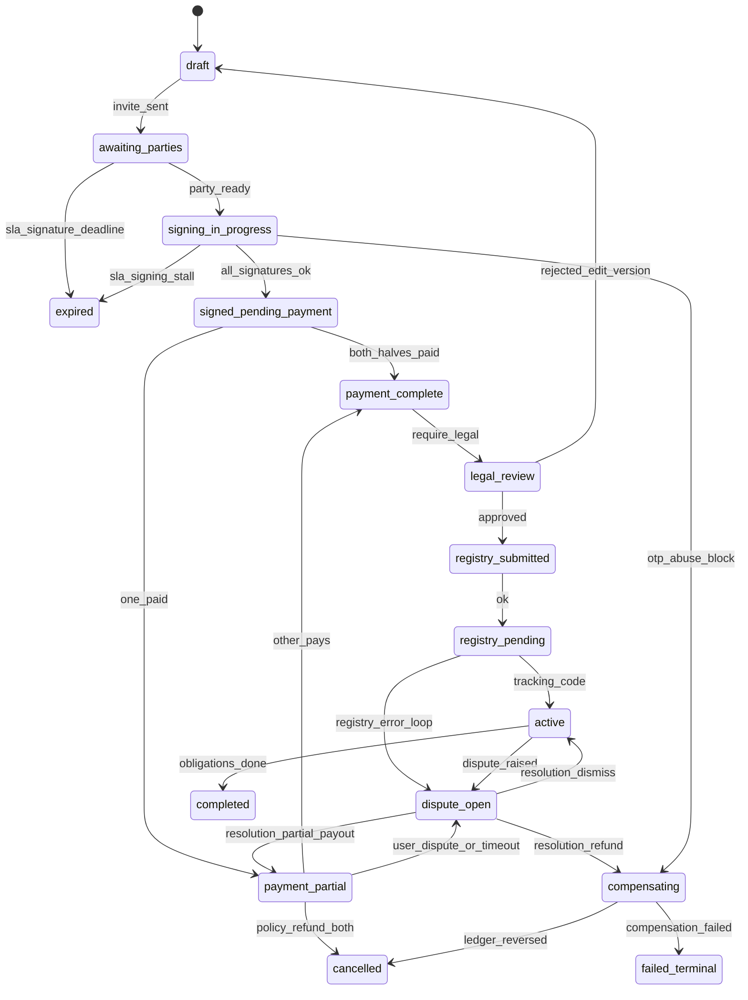
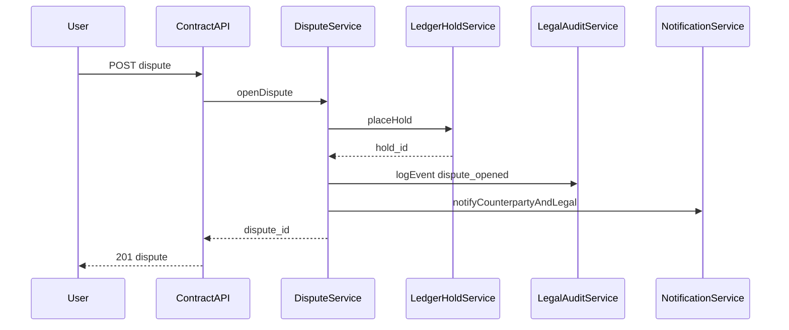
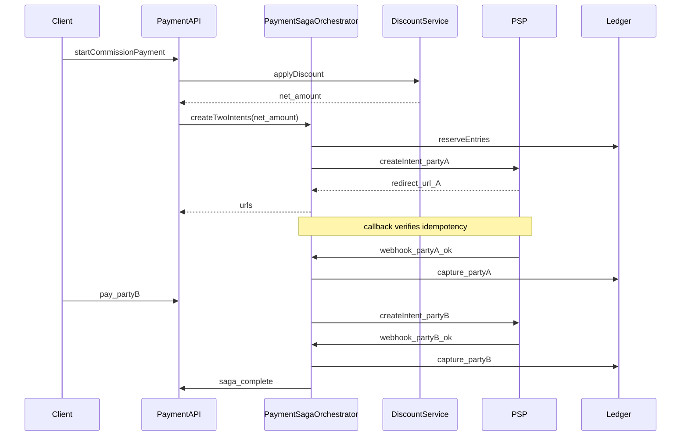
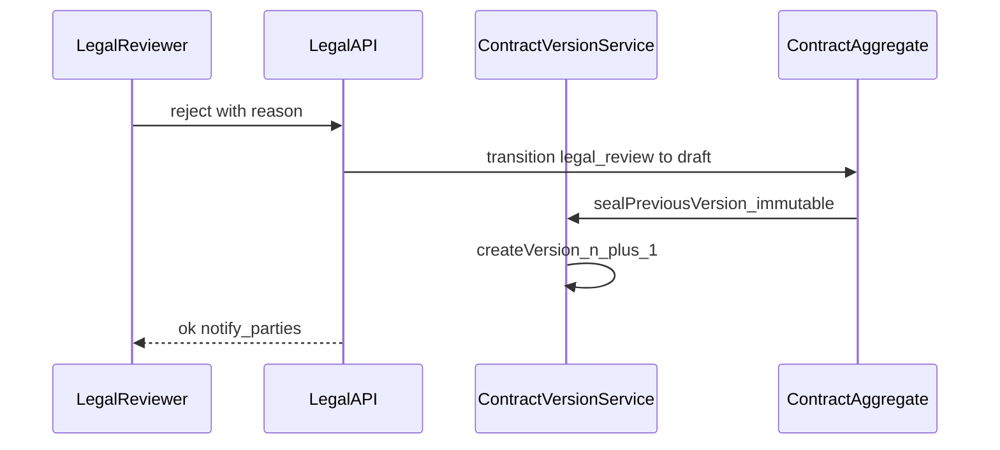

# معماری پروداکشن — پلتفرم قراردادمحور املاین

**نسخه:** ۱.۱  
**تاریخ:** ۲۰۲۶-۰۴-۰۴  
**وضعیت:** **سند هدف (Target) - نقشه راه معماری**  
**دامنه:** قرارداد اجاره/فروش، طرف‌ها، امضای OTP، کمیسیون ۵۰/۵۰، تخفیف، بازبینی حقوقی، ردیاب رسمی

> ⚠️ **هشدار برای توسعه‌دهنده جدید**
>
> این سند، معماری **مطلوب و نهایی** سامانه قراردادها است و به عنوان **نقشه راه** عمل می‌کند.
>
> **در کد فعلی شاخه `main` بسیاری از اجزای آن هنوز پیاده‌سازی نشده‌اند.**
>
> برای دیدن وضعیت واقعی و "As-built" حتماً به این اسناد مراجعه کنید:
>
> 1. [`AMLINE_MASTER_SPEC.md`](./AMLINE_MASTER_SPEC.md) (بخش وضعیت اجرایی)
> 2. [`REPO_SPEC_ALIGNMENT.md`](./REPO_SPEC_ALIGNMENT.md) (جدول Gap Analysis بین Target و As-built)

**اصول:** قرارداد در مرکز aggregate؛ پرداخت و امضا به‌صورت **Saga** با **ledger idempotent**؛ بدون میکروسرویس غیرضروری؛ طراحی برای کاربر ایرانی (اعتماد پایین، اصطکاک بالا — شفافیت، SMS، رسید).

---

## فهرست

1. [نمودار معماری به‌روز](#۱-نمودار-معماری-به‌روز-mermaid)  
2. [ماشین حالت قرارداد + شکست](#۲-ماشین-حالت-قرارداد--مدیریت-شکست)  
3. [ماژول‌ها و سرویس‌های جدید/گسترش‌یافته](#۳-فهرست-ماژولها-و-سرویسها)  
4. [طراحی لبه و شکست (جزئیات)](#۴-طراحی-لبه-و-شکست-edge--failure)  
5. [سیستم حل اختلاف](#۵-سیستم-حل-اختلاف-dispute)  
6. [موتور بازپرداخت و تسویه](#۶-موتور-بازپرداخت-و-تسویه-settlement-engine)  
7. [لایه اعتماد و ممیزی حقوقی](#۷-لایه-اعتماد-و-ممیزی-حقوقی)  
8. [ساده‌سازی UX](#۸-ساده‌سازی-ux-۴–۵-گام)  
9. [SLA و Timeout](#۹-sla-و-timeout)  
10. [رشد و حلقه وایرال](#۱۰-رشد-و-حلقه-وایرال)  
11. [نسخه‌گذاری قرارداد](#۱۱-نسخه‌گذاری-قرارداد)  
12. [رصدپذیری و عملیات](#۱۲-رصدپذیری-و-عملیات)  
13. [مدل داده (جداول/clusters)](#۱۳-به‌روزرسانی-مدل-داده)  
14. [نمودارهای توالی](#۱۴-نمودارهای-توالی-sequence)  
15. [کاهش ریسک](#۱۵-استراتژی-کاهش-ریسک)  
16. [مسیریابی اجزای معماری در کد فعلی](#۱۶-مسیریابی-اجزای-معماری-در-کد-فعلی)  
پیوست: [بک‌لاگ اولویت‌بندی‌شدهٔ اجرا](#appendix-contract-backlog)

---

## ۱. نمودار معماری به‌روز (Mermaid)

```mermaid
flowchart TB
  subgraph clients [Clients]
    WebUser[WebUserApp]
    WebAdmin[AdminUI]
    SMS[SMS_Gateway]
  end

  subgraph api [API_Monolith_FastAPI]
    ContractAgg[ContractAggregateService]
    PartySvc[PartyInvitationService]
    OtpSvc[OtpSignatureService]
    PaySaga[PaymentSagaOrchestrator]
    DiscSvc[DisputeService]
    SettleEng[SettlementEngine]
    AuditSvc[LegalAuditService]
    SlaJob[SlaScheduler]
    VersionSvc[ContractVersionService]
    NotifSvc[NotificationService]
  end

  subgraph data [Data_Postgres]
    CFlow[(contract_flow_state)]
    Ledger[(financial_ledger_entries)]
    Holds[(ledger_holds)]
    Disp[(disputes)]
    Aud[(audit_events)]
    Ver[(contract_document_versions)]
    Ref[(referral_attributions)]
  end

  subgraph external [External]
    PSP[PSP_Zarinpal_IdPay_NextPay]
    Reg[Registry_Legal_API]
    ObjStore[ObjectStorage_WORM_export]
  end

  WebUser --> ContractAgg
  WebAdmin --> DiscSvc
  WebAdmin --> SettleEng
  ContractAgg --> CFlow
  PartySvc --> NotifSvc
  OtpSvc --> AuditSvc
  PaySaga --> Ledger
  PaySaga --> PSP
  DiscSvc --> Holds
  DiscSvc --> Disp
  SettleEng --> Ledger
  SettleEng --> PSP
  ContractAgg --> Reg
  AuditSvc --> Aud
  AuditSvc --> ObjStore
  VersionSvc --> Ver
  SlaJob --> ContractAgg
  PartySvc --> Ref
  NotifSvc --> SMS
```

---

## ۲. ماشین حالت قرارداد + مدیریت شکست

### ۲.۱ حالت‌های اصلی (ترکیب flow + مالی + حقوقی)

| حالت | معنا | ورودی معمول |
|------|------|-------------|
| `draft` | پیش‌نویس، قابل ویرایش | ایجاد |
| `awaiting_parties` | دعوت طرف‌ها، تکمیل هویت/موبایل | ارسال دعوت |
| `signing_in_progress` | حداقل یک طرف در انتظار امضا | شروع امضا |
| `signed_pending_payment` | امضاها کامل یا «امضای شرطی»؛ منتظر پرداخت کمیسیون | policy محصول |
| `payment_partial` | فقط یک طرف پرداخت کرده | callback PSP |
| `payment_complete` | هر دو سهم یا قانون split برآورده شد | verify |
| `legal_review` | صف حقوقی داخلی یا خارجی | enqueue |
| `registry_submitted` | ارسال به سامانه رسمی | adapter |
| `registry_pending` | منتظر کد رهگیری | poll/webhook |
| `active` | قرارداد نهایی شده | کد رسمی + شرایط |
| `completed` | اجرای تعهدات به پایان (اختیاری دامنه) | manual/event |
| `cancelled` | لغو مجاز طبق قانون business | user/admin/sla |
| `expired` | SLA امضا/پرداخت | scheduler |
| `dispute_open` | اختلاف فعال؛ یخ‌زدگی مالی | user/admin |
| `compensating` | در حال جبران (برگشت پول/ledger) | saga failure |
| `failed_terminal` | غیرقابل ادامه بدون مداخله انسان | چند شکست پشت‌سرهم |

### ۲.۲ نمودار Mermaid (با شاخهٔ شکست)

### ۲.۳ Retry، Timeout، جبران (خلاصهٔ سیاست)

| سناریو | Retry | Timeout | جبران (compensation) |
|--------|-------|---------|----------------------|
| OTP تأخیر/خطا | exponential backoff؛ سقف ۵/۱۵ دقیقه per party | Cooldown بعد از N تلاش | قفل موقت امضا + اعلان تغییر کانال |
| شماره اشتباه | اصلاح توسط مالک flow + re-KYC سبک | — | ابطال دعوت قبلی؛ ردیاب audit |
| یک طرف امضا نمی‌کند | یادآوری روزانه؛ سپس `expired` | قابل تنظیم (مثلاً ۷۲h) | لغو یا تمدید با رضایت طرف دیگر |
| یکی پرداخت، دیگری نه | یادآوری + مهارت پرداخت | `payment_deadline` | `payment_partial` → بازپرداخت پرداخت‌کننده یا انتظار + dispute |
| دوبار پرداخت | **idempotency_key** + unique `(intent_id, party_id)` | — | بازگشت اضافه به همان wallet / reversal entry |
| رجیستری down | retry با circuit breaker | صف dead-letter | نگه‌داشت در `registry_pending`؛ SLA اعلان به ادمین |
| رد حقوقی | بازگشت به `draft` با version جدید | — | بدون تغییر نسخه امضاشدهٔ قبلی (immutable) |

---

## ۳. فهرست ماژول‌ها و سرویس‌ها

| نام | مسئولیت |
|-----|---------|
| `ContractAggregateService` | انتقال حالت canonical؛ قفل optimistic؛ رویداد دامنه |
| `PartyInvitationService` | دعوت، توکن لینک، attribution رفرال |
| `OtpSignatureService` | OTP، rate limit، lockout، ثبت audit |
| `PaymentSagaOrchestrator` | intent ۵۰/۵۰، تخفیف، callback PSP، همگام با ledger |
| `DiscountService` | اعتبارسنجی کد، سقف استفاده، audit |
| `LegalReviewService` | صف، ارجاع، نتیجه approve/reject |
| `RegistryAdapterService` | ارسال/وضعیت ردیاب؛ حالت قطعی فقط پس از verify |
| `DisputeService` | ایجاد، evidence، freeze، resolution workflow |
| `SettlementEngine` | refund کامل/جزئی، reversal کمیسیون، idempotent commands |
| `LedgerHoldService` | یخ‌زدگی موجودی هنگام dispute |
| `LegalAuditService` | ثبت append-only، hash chain، export دادگاه |
| `ContractVersionService` | نسخه سند، diff متادیتا، immutable پس از امضا |
| `SlaScheduler` | cron/worker؛ یادآوری؛ auto-expire |
| `NotificationService` | SMS/push الگو؛ اولویت تراکنش‌های مالی |
| `FraudSignalsService` | امتیاز ریسک؛ قوانین ساده + ML اختیاری |

همه در همان اپ `backend/backend` به‌صورت پکیج‌های `app/services/contracts_production/` (نام پیشنهادی) قابل پیاده‌سازی است.

---

## ۴. طراحی لبه و شکست (Edge & Failure)

### ۴.۱ قوانین کسب‌وکار کلیدی

- **Split ۵۰/۵۰:** مبلغ پایه پس از تخفیف → دو `PaymentIntent` با `amount_a` و `amount_b` (با رندینگ ریال در سمت سرور؛ یک ریال باقیمانده به طرف تعیین‌شده در policy).  
- **تخفیف:** اعمال قبل از split؛ `discount_allocation` (مثلاً فقط از سهم پلتفرم یا بین طرف‌ها طبق قانون محصول).  
- **لغو پس از پرداخت جزئی:** فقط از طریق `SettlementEngine` + حالت `compensating`؛ هرگز حذف فیزیکی ردیف ledger.

### ۴.۲ ضد سوءاستفاده OTP

- سقف `otp_send_per_phone_per_hour`، `otp_verify_failures_before_lockout`  
- ثبت `device_fingerprint` (hash) + IP در `audit_events`  
- Cooldown پس از lockout؛ مسیر ادمین برای باز کردن با ممیزی

---

## ۵. سیستم حل اختلاف (Dispute)

### ۵.۱ مدل داده (خلاصه)

جدول **`disputes`:** `id`, `contract_id`, `raised_by_party_id`, `category` (payment/signature/registry/legal/other), `status` (open/under_review/resolved/rejected), `resolution_type` (refund_full/refund_partial/payout_split/cancel_contract/dismiss), `created_at`, `resolved_at`, `resolver_user_id` (nullable برای workflow خودکار).

جدول **`dispute_evidence`:** `id`, `dispute_id`, `type` (audit_ref/chat_export/signature_snapshot/upload), `storage_uri`, `hash_sha256`, `submitted_by`, `created_at`.

جدول **`ledger_holds`:** `id`, `wallet_or_ledger_account`, `amount`, `currency`, `reason` (dispute_id), `released_at` nullable.

### ۵.۲ جریان

1. کاربر یا ادمین `POST /api/v1/contracts/{id}/disputes`  
2. `LedgerHoldService` روی مبالط درگیر (یا کل مانده قابل برداشت)  
3. اعلان به طرف مقابل و به صف حقوقی  
4. جمع‌آوری evidence از `audit_events` + export چت (hash شده)  
5. تصمیم: بازپرداخت / پرداخت جزئی / لغو / رد اختلاف → `SettlementEngine` + انتقال حالت قرارداد

### ۵.۳ نمودار توالی — باز کردن اختلاف

---

## ۶. موتور بازپرداخت و تسویه (Settlement Engine)

### ۶.۱ اصول

- هر عمل مالی = **`SettlementCommand`** با `idempotency_key` (UUID یا hash درخواست)  
- جدول **`financial_ledger_entries`:** فقط **append**؛ اصلاح = سطر جدید با `reversal_of_entry_id`  
- **دو فاز:** `authorize` (hold) → `capture` / `release` هماهنگ با PSP در صورت نیاز

### ۶.۲ انواع دستور

| نوع | توضیح |
|-----|--------|
| `REFUND_FULL` | برگشت همهٔ وجوه قابل برگشت مرتبط با contract_id |
| `REFUND_PARTIAL` | مبلغ و طرف مشخص؛ نیاز به dispute resolution یا ادمین |
| `COMMISSION_REVERSAL` | سطر معکوس همان سهم پلتفرم/آژانس |
| `WALLET_ADJUSTMENT` | تعدیل دفتر داخلی با دلیل و مرجع dispute |
| `SETTLEMENT_BATCH` | تسویه دوره‌ای به حساب بانکی (خارج از scope لحظه‌ای قرارداد) |

### ۶.۳ Rollback ایمن

- در شکست PSP پس از ثبت ledger محلی: وضعیت saga `compensating`؛ دستور `reverse_local_ledger` سپس تلاش مجدد PSP با همان `idempotency_key`  
- هیچ `DELETE` روی entries؛ فقط reversal و وضعیت saga

---

## ۷. لایه اعتماد و ممیزی حقوقی

### ۷.۱ `audit_events` (append-only)

فیلدهای پیشنهادی: `event_id`, `occurred_at`, `actor_type` (user/system/psp/registry), `actor_id`, `contract_id`, `party_id`, `action`, `ip_address`, `user_agent`, `device_hash`, `request_id`, `payload_json` (بدون PII حساس خام؛ یا رمز شده), `prev_hash`, `event_hash` (زنجیره اختیاری برای یکپارچگی).

### ۷.۲ ذخیرهٔ بلندمدت

- Export **WORM** (bucket با object lock) برای بستهٔ دادگاه: PDF خلاصه + JSON امضاها + ledger + لاگ‌های hash شده  
- رعایت **قانون حفاظت داده** ایران و سیاست نگهداری (retention) شفاف برای کاربر

### ۷.۳ انطباق

- حداقل‌نگاری PII در لاگ؛ توافق رضایت در onboarding  
- دسترسی ادمین به export با RBAC `legal:export` + ممیزی دسترسی

---

## ۸. ساده‌سازی UX (۴–۵ گام)

**گام ۱ — شروع:** نوع قرارداد + خلاصهٔ ملک (یک صفحه).  
**گام ۲ — طرف‌ها:** موبایل/نقش؛ دعوت با لینک؛ نمایش «چه کسی اضافه شده».  
**گام ۳ — امضا:** یک صفحه با وضعیت هر طرف (✓ امضا / ⏳ در انتظار / ✗ رد شده).  
**گام ۴ — پرداخت:** مبلغ نهایی بعد تخفیف؛ دو دکمه یا یک جریان ترتیبی شفاف «نوبت شما برای پرداخت».  
**گام ۵ — پیگیری:** کد رهگیری + «قدم بعد» (حقوقی/رسمی) + پشتیبانی.

**ویجت وضعیت (همیشه قابل مشاهده):**  
«امضا: ۲ از ۳» — «پرداخت: طرف A ✓ — طرف B ⏳» — «مرحله بعد: پرداخت طرف B تا فردا».

---

## ۹. SLA و Timeout

| رویداد | پیش‌فرض پیشنهادی | اقدام پس از انقضا |
|--------|------------------|-------------------|
| دعوت امضا | ۷۲ ساعت | یادآوری ۲۴h و ۴۸h؛ سپس `expired` یا تمدید |
| تکمیل همه امضاها | — | انتقال به پرداخت |
| مهلت پرداخت هر طرف | ۴۸ ساعت پس از نوبت | یادآوری؛ سپس `payment_partial` یا dispute |
| پاسخ رجیستری | ۵ روز کاری | escalation ادمین |
| اختلاف بدون پاسخ داخلی | ۷۲ ساعت | escalation |

پیکربندی در **`contract_sla_rules`** per `contract_type` و per agency.

---

## ۱۰. رشد و حلقه وایرال

- هر **دعوت طرف** = `referral_attributions` (inviter_party_id، invited_phone_hash، قرارداد منشأ)  
- پاداش قابل تنظیم (اعتبار کارمزد بعدی) پس از `active` شدن قرارداد  
- ضد تقلب: حداکثر پاداش per device/IP؛ تاخیر تسویه پاداش تا پایان dispute window

---

## ۱۱. نسخه‌گذاری قرارداد

- **`contract_document_versions`:** `version_no`, `contract_id`, `content_hash`, `json_snapshot`, `created_at`, `created_by`, `status` (draft/submitted/signed_sealed)  
- پس از `signed_sealed`: **immutable** — تغییر فقط با `version_no+1` و مسیر `legal_review` reject  
- **diff:** ذخیرهٔ `field_changes_json` بین نسخه‌ها برای نمایش به کاربر و حقوقی

---

## ۱۲. رصدپذیری و عملیات

- **Logging:** ساخت‌یافته JSON؛ `contract_id`, `party_id`, `saga_id` روی هر log مرتبط  
- **Metrics:** `contract_state_total{state}`, `payment_intent_success_total`, `otp_rate_limited_total`, `dispute_open_total`, `settlement_command_duration_seconds`  
- **Alerting:** نرخ شکست PSP، صف registry، حجم dispute، anomaly OTP  
- **Fraud signals:** سرعت تغییر IP، چند قرارداد همزمان یک موبایل، mismatch device

هم‌راستا با [`runbooks/OBSERVABILITY.md`](./runbooks/OBSERVABILITY.md) موجود.

---

## ۱۳. به‌روزرسانی مدل داده

| موجودیت / جدول | نقش |
|----------------|-----|
| `contract_flow_state` | گسترش ستون‌ها یا جدول جانبی برای `substate`, `sla_deadlines_json` |
| `payment_intents` | `party_id`, `amount`, `idempotency_key`, `status`, `psp_ref` |
| `financial_ledger_entries` | append-only + reversal link |
| `ledger_holds` | dispute / manual freeze |
| `disputes`, `dispute_evidence` | همان §۵ |
| `audit_events` | §۷ |
| `contract_document_versions` | §۱۱ |
| `contract_sla_rules` | §۹ |
| `referral_attributions` | §۱۰ |
| `settlement_commands` | وضعیت اجرای idempotent command |

---

## ۱۴. نمودارهای توالی (Sequence)

### ۱۴.۱ پرداخت split ۵۰/۵۰ با تخفیف

### ۱۴.۲ رد حقوقی و نسخه جدید

---

## ۱۵. استراتژی کاهش ریسک

| ریسک | کاهش |
|------|------|
| دوبار پرداخت / race | idempotency + DB unique constraint + saga state |
| جعل امضا / OTP | rate limit + audit + optional step-up |
| اختلاف بی‌پایان | SLA + escalation + حداکثر مدت hold |
| خروجی دادگاه نامعتبر | hash chain + WORM + زمان‌نگاشت استاندارد |
| از دست رفتن اعتماد کاربر | UX شفاف + SMS در هر گام حیاتی |
| وابستگی رجیستری | حالت `registry_pending` + صف + شفافیت برای کاربر |

---

## ۱۶. مسیریابی اجزای معماری در کد فعلی

این بخش به شما نشان می‌دهد هر جزء از معماری هدف، در کجای کد فعلی قرار دارد یا باید قرار بگیرد. مسیرها نسبت به ریشهٔ `backend/backend/` هستند (بازبینی شده با as-built شاخهٔ `main`).

| نام در سند (Target) | مسیر / محل در کد فعلی | وضعیت فعلی |
| :--- | :--- | :--- |
| `ContractAggregateService` | `app/services/v1/contract_flow_service.py` (`ContractFlowService`) | **بخشی** — جریان New Flow و حافظه/DB در حال هم‌ترازی؛ نیاز به توسعه مطابق Saga و state این سند |
| `PartyInvitationService` | دعوت بتا: `app/repositories/v1/launch_repository.py`؛ طرف‌های قرارداد در flow قرارداد | **بخشی** — سرویس مجزا با این نام وجود ندارد؛ دعوت طرف قرارداد در همان ماژول flow |
| `OtpSignatureService` | `app/services/v1/otp_service.py` + `signature_service.py` | **پیاده‌سازی شده** (با محدودیت‌های پروداکشن طبق Master) |
| `PaymentSagaOrchestrator` | `app/services/v1/psp_payment_service.py`، `app/api/v1/payment_routes.py` | **بخشی** — PSP و idempotency موجود؛ **orchestrator split ۵۰/۵۰ و Saga کامل این سند نیست** |
| `DiscountService` | سرویس اختصاصی با این نام در کد یافت نشد | **نامشخص / نیاز به پیاده‌سازی** مطابق بک‌لاگ |
| `DisputeService` | — | **پیاده‌سازی نشده** — اولویت P1 |
| `SettlementEngine` | — | **پیاده‌سازی نشده** — اولویت P2 |
| `LedgerHoldService` | — | **پیاده‌سازی نشده** — اولویت P1 |
| `LegalAuditService` | `app/models/audit_log.py` (`AuditLogEntry`) + مصرف در API ادمین | **بخشی** — export حقوقی / hash chain این سند نیست |
| جدول ممیزی (معادل `audit_events`) | `app/models/audit_log.py` — جدول `audit_log_entries` | **پیاده‌سازی شده** — مدل **`AuditLogEntry`** (نه `AuditEvent`) |
| معادل `financial_ledger_entries` | `app/models/wallet.py` — جدول `wallet_ledger_entries` | **بخشی** — دارای `idempotency_key`؛ فیلد **`reversal_of_entry_id`** طبق این سند هنوز نیست |
| وضعیت / رکورد flow قرارداد | `app/models/contract_flow.py` (`ContractFlowRecord` و وابسته‌ها) | **اسکیما موجود** — اتصال کامل به مسیر اجرای production در پیشرفت |
| `disputes` (جدول) | — | **پیاده‌سازی نشده** — اولویت P1 |

> **نکته:** اگر جزئی از معماری در این جدول نیست، به این معناست که هنوز در کد پیاده‌سازی نشده و باید بر اساس اولویت‌بندی پیوست این سند توسعه داده شود.

## پیوست: بک‌لاگ اولویت‌بندی‌شدهٔ اجرا

برای تبدیل به Issue/GitHub Epic می‌توان از برچسب‌های `epic:contract-production` استفاده کرد.

| اولویت | Epic | وضعیت / لینک |
| :--- | :--- | :--- |
| P0 | Ledger + idempotency + split ۵۰/۵۰ + تخفیف | `TODO: ایجاد Issue` |
| P0 | State machine + SLA job | `TODO: ایجاد Issue` |
| P1 | Audit append-only + export حقوقی پایه | `TODO: ایجاد Issue` |
| P1 | Dispute + hold | `TODO: ایجاد Issue` |
| P2 | SettlementEngine (refund/reversal) | `TODO: ایجاد Issue` |
| P2 | Versioning + diff | `TODO: ایجاد Issue` |
| P3 | Referral + fraud signals | `TODO: ایجاد Issue` |

---

**پایان سند.**
