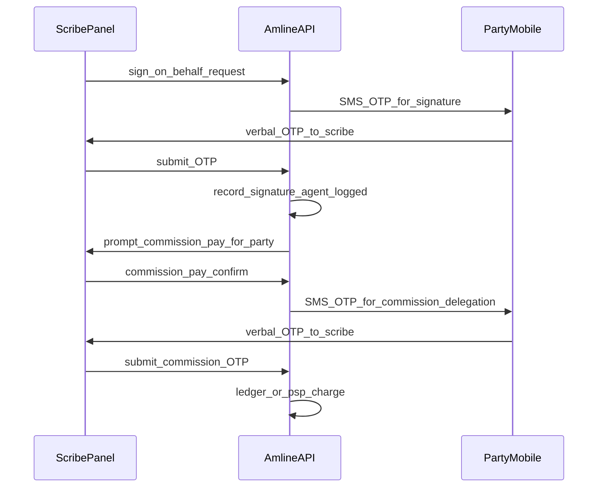
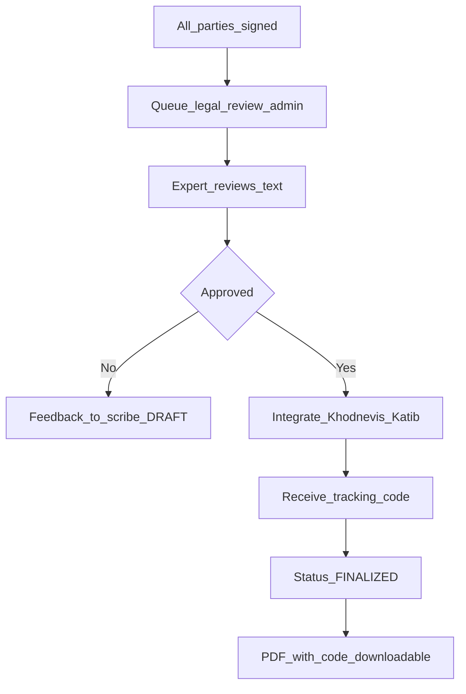

# 📘 سند جامع و واحد محصول Amline (Amline Complete Product Master Specification)

**نسخه نهایی:** 2.0 (پوشش تمام انواع قراردادهای ملکی)  
**تاریخ انتشار:** فروردین ۱۴۰۵  
**وضعیت:** مبتنی بر سیستم زنده با ۲۷,۰۰۰ کاربر و نقشه‌راه مهاجرت به نسل جدید  
**نوع سند:** معماری + محصول + فلوها + قراردادهای چندگانه + نقشه‌راه اجرایی

---

## 🧩 بخش ۱: تعریف محصول (Product Definition)

### ۱.۱. جمله یک خطی
> **Amline** یک سوپر اپ تخصصی املاک و قرارداد آنلاین است که مسیر «فایل و آگهی → لید و مذاکره → بازدید → **هر نوع قرارداد ملکی** → پرداخت و کد رهگیری» را برای مردم، مشاوران و آژانس‌ها یکپارچه و آنلاین مدیریت می‌کند.

### ۱.۲. انواع قراردادهای پشتیبانی‌شده

| نوع قرارداد | وضعیت | توضیح |
|-------------|--------|--------|
| **رهن و اجاره** | ✅ موجود (نیاز به ری‌دیزاین) | قرارداد بین موجر و مستأجر |
| **خرید و فروش** | ❌ باید پیاده‌سازی شود | قرارداد بیع بین فروشنده و خریدار |
| **معاوضه** | ❌ باید پیاده‌سازی شود | مبادله ملک با ملک دیگر |
| **مشارکت در ساخت** | ❌ باید پیاده‌سازی شود | بین مالک زمین و سازنده |
| **پیش‌فروش آپارتمان** | ❌ باید پیاده‌سازی شود | طبق قانون پیش‌فروش ساختمان |
| **اجاره به شرط تملیک** | ❌ باید پیاده‌سازی شود | ترکیبی از اجاره و خرید |

### ۱.۳. سه لایه اصلی (مشابه اسنپ)

| لایه | مخاطب | دامنه / اپ | نقش کلیدی |
|------|--------|-------------|-------------|
| **لندینگ و معرفی** | عموم مردم | `amline.ir` | صفحه اصلی، SEO، دانلود اپ، ورود/ثبت‌نام |
| **پنل یکپارچه کاربران** | مشاوران + مردم عادی | `app.amline.ir` (وب/موبایل/PWA + بله/ایتا) | دو پنل مجزا بر اساس نقش (مشاور / مردم) |
| **پنل داخلی** | کارشناسان حقوقی، پشتیبانی، مدیران | `admin.amline.ir` | تأیید قرارداد، مدیریت کاربران، گزارش‌گیری مالی و عملیاتی |

---

## 🏗️ بخش ۲: معماری کلان (High-Level Architecture)

### ۲.۱. دیاگرام Container (سطح C4)

```
┌─────────────────────────────────────────────────────────────────┐
│                         External Systems                        │
│  Khodnevis │ Katib │ PSPs (Zarinpal, IDPay) │ Map │ SMS Gateway │
└───────────────────────────────┬─────────────────────────────────┘
                                │
                                ▼
┌─────────────────────────────────────────────────────────────────┐
│                    API Gateway (Traefik/Nginx)                  │
│                 (Auth, Rate Limit, Routing, Fallback)           │
└───┬───────────────┬───────────────┬───────────────┬─────────────┘
    │               │               │               │
    ▼               ▼               ▼               ▼
┌─────────┐   ┌──────────┐   ┌──────────┐   ┌──────────────┐
│amline.ir│   │app.amline.ir (PWA)│   │admin.amline.ir│   │Internal    │
│Landing  │   │ ┌────────┬───────┐│   │(Internal)     │   │Services    │
│(Next.js)│   │ │Agent   │Public ││   │               │   │(not exposed)│
└─────────┘   │ │Panel   │Panel  ││   └───────┬───────┘   └──────┬───────┘
              │ └────────┴───────┘│           │                   │
              └─────────┬─────────┘           │                   │
                        └─────────────────────┼───────────────────┘
                                              ▼
                              ┌───────────────────────────────┐
                              │    Backend Services (FastAPI)  │
                              │  Auth, CRM, Listing, Contract, │
                              │  Payment, Billing, ML Pricing, │
                              │  Temporal, Matrix, Audit       │
                              └───────────────┬───────────────┘
                                              │
                              ┌───────────────┼───────────────┐
                              ▼               ▼               ▼
                        ┌──────────┐   ┌──────────┐   ┌──────────┐
                        │PostgreSQL│   │  Redis   │   │ MinIO/S3 │
                        │ +Metabase│   │(Cache)   │   │(Files)   │
                        └──────────┘   └──────────┘   └──────────┘
```

### ۲.۲. سرویس‌های اصلی (Core Services)

| سرویس | مسئولیت |
|--------|-----------|
| **Auth** | ثبت‌نام، لاگین، OTP، RBAC (مشاور، مردم، کارشناس، ادمین) |
| **Listing** | مدیریت آگهی‌های رهن، اجاره، خرید، فروش، معاوضه + جستجوی Meilisearch |
| **CRM** | مدیریت لید، تماس، یادداشت، پیگیری (مخصوص پنل مشاور) |
| **Visit** | رزرو بازدید، تقویم، هماهنگی |
| **Contract** | **مهم‌ترین سرویس:** مدیریت **همه انواع قراردادهای ملکی** (رهن/اجاره، خرید/فروش، معاوضه، مشارکت، پیش‌فروش، اجاره به شرط تملیک) |
| **Payment** | کیف پول، درگاه پرداخت (Zarinpal, IDPay, NextPay)، کمیسیون |
| **Billing** | اشتراک آژانس‌ها، صورتحساب |
| **ML Pricing** | قیمت‌گذاری هوشمند ملک |
| **Temporal** | گردش‌کارهای طولانی (ثبت قرارداد → امضا → تأیید → کد رهگیری) |
| **Matrix** | پیام‌رسان داخلی مشاور–مردم |
| **Audit + Ledger** | ثبت تمام رویدادها و تراکنش‌های مالی (غیرقابل تغییر) |
| **Integration Adapters** | اتصال به خودنویس، کاتب، نقشه، پیامک |

---

## 🧩 بخش ۳: مدل داده قرارداد هوشمند (قابل تعمیم به همه قراردادها)

### ۳.۱. ساختار اصلی (تعمیم‌یافته)

```yaml
Contract:
  id: UUID
  type:
    - "RENT"           # رهن و اجاره
    - "SALE"           # خرید و فروش
    - "EXCHANGE"       # معاوضه
    - "CONSTRUCTION"   # مشارکت در ساخت
    - "PRE_SALE"       # پیش‌فروش آپارتمان
    - "LEASE_TO_OWN"   # اجاره به شرط تملیک
  status:
    - DRAFT
    - AWAITING_SIGNATURES
    - SIGNED
    - REVIEWED_BY_EXPERT
    - FINALIZED
    - TERMINATED
  created_at: datetime
  created_by: User (کاتب – می‌تواند مشاور یا شخص عادی باشد)
  parties: List[Party]
  witnesses: List[Witness]
  terms: ContractTerms (قرارداد خاص)
  payments: List[Payment]
  amendments: List[Amendment]
  external_refs:
    khodnevis_id: string
    katib_id: string
    tracking_code: string (کد رهگیری نهایی)
```

### ۳.۲. Party (طرف قرارداد – حقیقی/حقوقی – تعمیم‌یافته)

```yaml
Party:
  role:
    - "SELLER" | "BUYER"           # برای خرید و فروش
    - "LANDLORD" | "TENANT"        # برای رهن و اجاره
    - "EXCHANGER_FIRST" | "EXCHANGER_SECOND"  # برای معاوضه
    - "LAND_OWNER" | "CONTRACTOR"  # برای مشارکت در ساخت
    - "DEVELOPER" | "BUYER"        # برای پیش‌فروش
    - "LESSOR" | "LESSEE"          # برای اجاره به شرط تملیک
  type: "NATURAL" | "LEGAL"
  natural:
    first_name, last_name, national_id, phone
  legal:
    company_name, registration_number, economic_code, authorized_signatory
  signature_status: "PENDING" | "SIGNED_BY_OTP" | "REJECTED"
  signature_method: "SELF_OTP" | "AGENT_OTP" | "ADMIN_OTP" | "AUTO"
  agent_user_id: UUID (در صورت امضا توسط کاتب)
```

### ۳.۳. ContractTerms (برای هر نوع قرارداد – ساختار مجزا)

#### برای رهن و اجاره (RENT):
```yaml
RentTerms:
  property_address: string
  rent_amount: int (اجاره ماهیانه)
  deposit_amount: int (رهن)
  contract_duration_months: int
  start_date: date
  end_date: date
  special_conditions: string
```

#### برای خرید و فروش (SALE):
```yaml
SaleTerms:
  property_address: string
  total_price: int (مبلغ کل معامله)
  payment_plan:
    - type: "ONLINE" | "CHEQUE" | "CASH"
      amount: int
      due_date: date
  transfer_date: date (تاریخ انتقال سند)
  has_encumbrance: boolean (آیا ملک در رهن بانک است؟)
  encumbrance_details: string (اختیاری)
```

#### برای معاوضه (EXCHANGE):
```yaml
ExchangeTerms:
  first_property_address: string
  second_property_address: string
  price_difference: int (مبلغ تفاوت – اگر یکی گران‌تر است)
  payment_plan: List[Payment]
```

#### برای مشارکت در ساخت (CONSTRUCTION):
```yaml
ConstructionTerms:
  land_address: string
  land_owner_name: string
  contractor_name: string
  land_owner_share_percent: int (مثلاً ۴۰٪)
  contractor_share_percent: int (مثلاً ۶۰٪)
  estimated_completion_date: date
  penalty_for_delay: int (جریمه روزانه)
```

#### برای پیش‌فروش آپارتمان (PRE_SALE):
```yaml
PreSaleTerms:
  project_name: string
  unit_number: string
  total_price: int
  payment_schedule:
    - stage: "RESERVATION" | "FOUNDATION" | "FRAMING" | "FINISHING" | "DELIVERY"
      percent: int
      due_date: date
  delivery_date: date
  penalty_for_delay: int
```

#### برای اجاره به شرط تملیک (LEASE_TO_OWN):
```yaml
LeaseToOwnTerms:
  property_address: string
  monthly_rent: int
  contract_duration_months: int
  final_purchase_price: int (قیمت نهایی خرید پس از پایان اجاره)
  rent_credited_to_price: int (چقدر از اجاره به قیمت نهایی خورده می‌شود)
  purchase_option_deadline: date (آخرین مهلت برای تصمیم به خرید)
```

### ۳.۴. کمیسیون (برای همه قراردادها)

```yaml
Commission:
  type: "RENT_COMMISSION" | "SALE_COMMISSION" | "EXCHANGE_COMMISSION" | "CONSTRUCTION_COMMISSION"
  paid_by: "PARTY_A" | "PARTY_B" | "BOTH" | "CONTRACT_CREATOR"
  amount: int
  status: "PENDING" | "PAID"
  payment_method: "SELF" | "AGENT" | "ADMIN"
```

---

## 🔄 بخش ۴: فلوهای اصلی محصول (User Journeys)

### ۴.۱. فلو شماره ۱: ثبت قرارداد توسط کاتب (برای هر نوع قرارداد)

```mermaid
graph TD
    A[ورود به app.amline.ir] --> B{نقش کاربر؟}
    B -->|مشاور| C[داشبورد مشاور → دکمه قرارداد جدید]
    B -->|مردم| D[پنل عمومی → دکمه نوشتن قرارداد]
    C --> E[انتخاب نوع قرارداد]
    D --> E
    E --> F1[رهن/اجاره]
    E --> F2[خرید/فروش]
    E --> F3[معاوضه]
    E --> F4[سایر انواع]
    F1 --> G1[فرم مخصوص رهن/اجاره]
    F2 --> G2[فرم مخصوص خرید/فروش]
    F3 --> G3[فرم مخصوص معاوضه]
    F4 --> G4[فرم پویا بر اساس نوع]
    G1 --> H[وارد کردن اطلاعات طرفین]
    G2 --> H
    G3 --> H
    G4 --> H
    H --> I[وارد کردن اطلاعات شاهد (اختیاری)]
    I --> J[پیش‌نمایش قرارداد]
    J --> K{تأیید نهایی؟}
    K -->|خیر| L[بازگشت به ویرایش]
    K -->|بله| M[ذخیره به عنوان DRAFT]
    M --> N[دکمه ارسال برای امضا]
```

### ۴.۲. فلو شماره ۲: سناریوهای امضای قرارداد (۵ حالت – یکسان برای همه قراردادها)

| سناریو | توضیح | چه کسی کد را دریافت می‌کند؟ | چه کسی کد را وارد می‌کند؟ | نتیجه |
|--------|--------|----------------------------|---------------------------|--------|
| **S1 (عادی)** | طرف قرارداد خودش لینک را باز می‌کند و کد را خودش وارد می‌کند | طرف قرارداد | طرف قرارداد | امضای طرف ثبت می‌شود |
| **S2 (کاتب‌محور)** | طرف قرارداد کد را به کاتب می‌گوید و کاتب در پنل خودش کد را وارد می‌کند | طرف قرارداد | کاتب (در پنل خودش) | امضای طرف ثبت می‌شود + لاگ “امضا توسط کاتب به نمایندگی” |
| **S3 (حضوری)** | کاتب و طرف قرارداد کنار هم هستند؛ کاتب کد را از موبایل طرف می‌خواند و وارد می‌کند | طرف قرارداد | کاتب (در پنل خودش) | امضای طرف ثبت می‌شود |
| **S4 (بدون موبایل)** | طرف قرارداد موبایل ندارد؛ کاتب از ادمین درخواست کد یکبار مصرف می‌کند | ادمین (کارشناس املاین) | کاتب (با تأیید ادمین) | امضای طرف ثبت می‌شود + لاگ “امضا با تأیید ویژه” |
| **S5 (خودکار)** | کاربر قبلاً «امضای خودکار» را در تنظیمات فعال کرده باشد (برای قراردادهای زیر مبلغ مشخص) | – | سیستم | امضای خودکار ثبت می‌شود + اعلان بعدی |

### ۴.۳. فلو شماره ۳: سناریوهای پرداخت کمیسیون (۴ حالت – یکسان برای همه قراردادها)

| سناریو | توضیح | چه کسی پرداخت را انجام می‌دهد؟ | از کدام کیف پول/درگاه؟ | مجوز |
|--------|--------|-------------------------------|------------------------|-------|
| **P1 (عادی)** | طرف قرارداد خودش لینک پرداخت را باز می‌کند و پرداخت می‌کند | طرف قرارداد | کیف پول خودش یا درگاه بانکی | – |
| **P2 (کاتب از طرف شخص)** | کاتب می‌خواهد از طرف یکی از طرفین کمیسیون را پرداخت کند | کاتب | کیف پول کاتب یا کارت بانکی کاتب | نیاز به تأیید صریح طرف قرارداد (با کد پیامکی دیگر) |
| **P3 (کیف پول مشترک)** | کاتب قبلاً از طرف قرارداد وکالت گرفته باشد (در سامانه) | کاتب | کیف پول طرف قرارداد (با وکالت) | وکالت قبلی در سیستم |
| **P4 (ادمین)** | به دلیل مشکل فنی، ادمین پرداخت را ثبت می‌کند | ادمین | درگاه داخلی املاین | نیاز به لاگ و تأیید مدیر مالی |

### ۴.۴. فلو شماره ۴: ترکیب امضا و پرداخت توسط کاتب (سناریوی T1 – یکسان برای همه قراردادها)



### ۴.۵. فلو شماره ۵: تأیید کارشناس و اتصال به خودنویس/کاتب (برای همه قراردادها)



---

## 📋 بخش ۵: اولویت‌های اجرایی (بر اساس انواع قرارداد)

| اولویت | نوع قرارداد | وضعیت فعلی | کار مورد نیاز | زمان تخمینی |
|--------|--------------|-------------|----------------|--------------|
| **P0** | **رهن و اجاره** | موجود (نیاز به ری‌دیزاین) | بازطراحی بر اساس مدل جدید + سناریوهای S1-S5 و P1-P4 | ۱ هفته |
| **P1** | **خرید و فروش** | باید پیاده‌سازی شود | طراحی مدل داده + فرم + فلو + اتصال به خودنویس | ۱ هفته |
| **P2** | **معاوضه** | باید پیاده‌سازی شود | طراحی مدل داده + فرم + فلو | ۳ روز |
| **P2** | **اجاره به شرط تملیک** | باید پیاده‌سازی شود | طراحی مدل داده + فرم + فلو | ۳ روز |
| **P3** | **مشارکت در ساخت** | باید پیاده‌سازی شود | طراحی مدل داده + فرم + فلو + قوانین خاص | ۱ هفته |
| **P3** | **پیش‌فروش آپارتمان** | باید پیاده‌سازی شود | طراحی مدل داده + فرم + فلو + تطبیق با قانون پیش‌فروش | ۱ هفته |

---

## 🧭 بخش ۶: استراتژی مهاجرت (Strangler Fig)

| گام | بازه | کار | معیار موفقیت |
|------|------|-----|----------------|
| ۰ | هفته ۱ | استقرار Gateway جلوی همه دامنه‌ها | همه ترافیک از Gateway عبور کند |
| ۱ | هفته ۲-۳ | ساخت Contract Service جدید (همه انواع) | API جدید در staging پاسخ دهد |
| ۲ | هفته ۴ | هدایت ۱٪ درخواست‌های مشاهده قرارداد به سرویس جدید | خطای صفر |
| ۳ | هفته ۵ | فعال‌سازی ایجاد رهن/اجاره با feature flag | فقط کاربران خاص |
| ۴ | هفته ۶-۷ | افزایش ترافیک به ۱۰۰٪ برای رهن/اجاره | قراردادهای جدید از سرویس جدید |
| ۵ | هفته ۸-۱۲ | اضافه کردن سایر انواع قرارداد | هر نوع جداگانه فعال شود |
| ۶ | هفته ۱۳ | حذف کد قدیمی قرارداد | – |

**Fallback:** در هر مرحله، اگر سرویس جدید ۵۰۰ داد، Gateway به طور خودکار درخواست را به سیستم قدیم هدایت کند. جزئیات: [`STRANGLER_GATEWAY_SETUP.md`](./STRANGLER_GATEWAY_SETUP.md).

---

## 📚 بخش ۷: مستندات مورد نیاز (ریپو)

| نام فایل | محتوا | اولویت |
|----------|--------|--------|
| `Amline_Complete_Master_Spec_v2.md` | همین سند | P0 |
| `CONTRACT_DATA_MODELS.md` | مدل داده تمام ۶ نوع قرارداد | P0 |
| `CONTRACT_SERVICE_API_SPEC.md` | مستند API سرویس قرارداد | P0 |
| `STRANGLER_GATEWAY_SETUP.md` | Gateway و feature flags | P0 |
| `SIGNATURE_PAYMENT_SCENARIOS.md` | S1-S5 و P1-P4 | P1 |
| `STATUS_MAPPING_v2.md` | نگاشت وضعیت v2 ↔ کد | P0 |
| `SALE_CONTRACT_FLOW.md` | فلو خرید و فروش | P1 |
| `EXCHANGE_CONTRACT_FLOW.md` | فلو معاوضه | P2 |
| `LEASE_TO_OWN_FLOW.md` | فلو اجاره به شرط تملیک | P2 |
| `CONSTRUCTION_CONTRACT_FLOW.md` | فلو مشارکت در ساخت | P3 |
| `PRE_SALE_CONTRACT_FLOW.md` | فلو پیش‌فروش | P3 |

---

## ✅ بخش ۸: جمع‌بندی

1. استقرار Gateway قبل از تغییر رفتاری پروداکشن.
2. هسته Contract (مدل + API مشترک) سپس رهن/اجاره (P0) با امضا و پرداخت کامل.
3. خرید و فروش (P1) و سپس سایر انواع طبق جدول اولویت.

**پایان سند جامع و واحد محصول Amline (نسخه ۲)**

