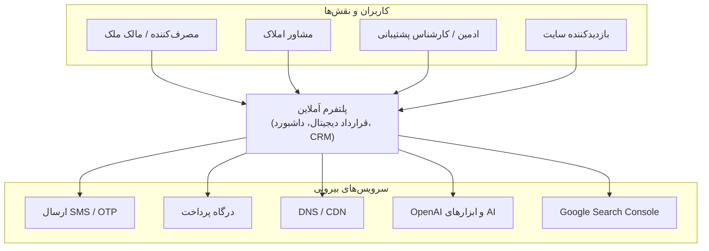
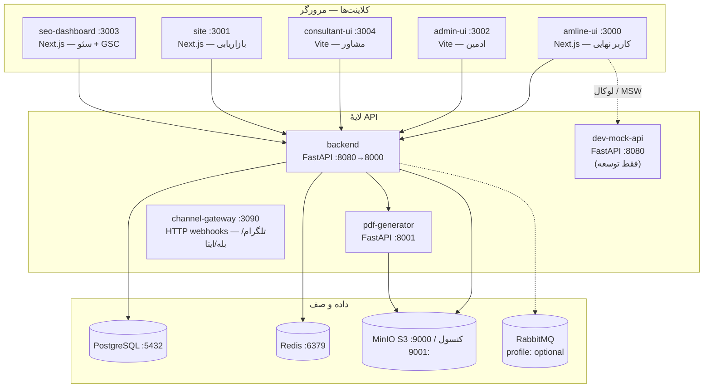
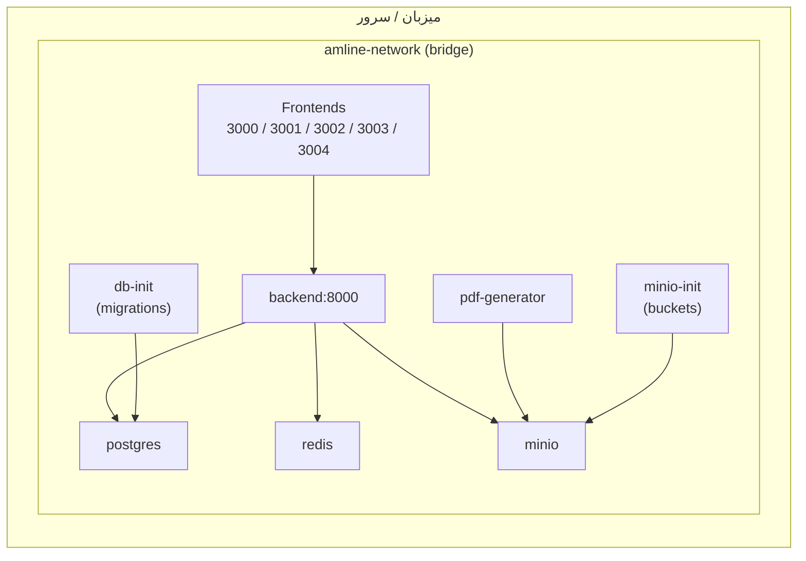
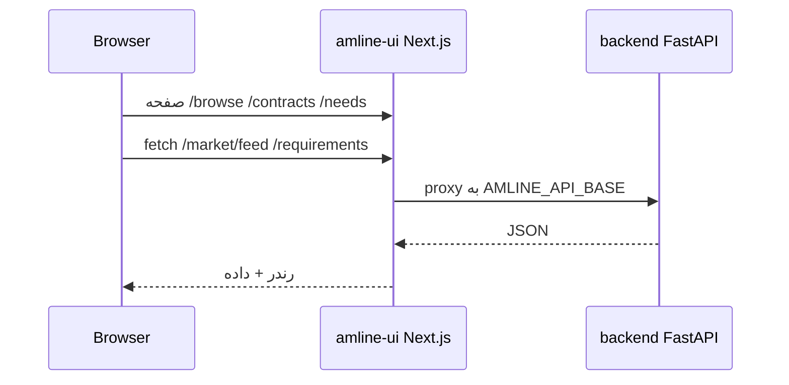
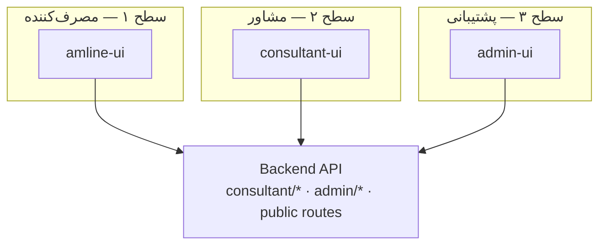
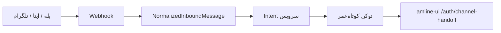
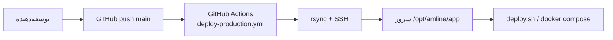
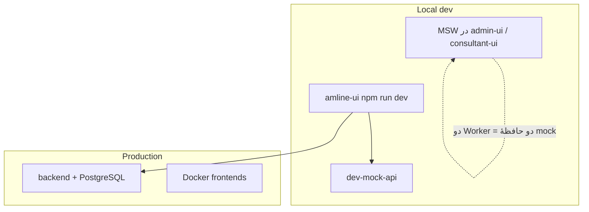
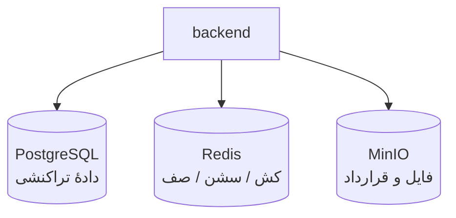

# دیاگرام معماری پلتفرم اَملاین (Amline)

این سند **نمای کامل** لایه‌های پلتفرم، سرویس‌ها، جریان داده و استقرار را با **Mermaid** ارائه می‌کند. در GitHub و ابزارهایی که Mermaid را رندر می‌کنند، نمودارها به‌صورت خودکار نمایش داده می‌شوند.

---

## ۱) نمای زمینه (C4 — System Context)

کاربران بیرونی و سیستم‌های همسایه نسبت به **پلتفرم اَملاین** به‌عنوان یک جعبهٔ سیاه.



---

## ۲) نمای کانتینرها (C4 — Containers)

برنامه‌های فرانت، APIها و زیرساخت داخل مرز سازمانی (شبکهٔ Docker: `amline-network`).



---

## ۳) توپولوژی استقرار Docker (Production-style)

نگاشت سرویس‌های تعریف‌شده در `docker-compose.yml` (پورتهای میزبان نمونه).



---

## ۴) ماتریس اپلیکیشن‌ها (پورت توسعه)

| بسته | پورت نمونه | کاربر اصلی |
|------|------------|------------|
| `amline-ui` | 3000 | متقاضی قرارداد، امضا، نیازمندی، بازار |
| `site` | 3001 | بازاریابی، لندینگ |
| `admin-ui` | 3002 | کاربران، قراردادها، CRM، مشاوران |
| `seo-dashboard` | 3003 (لوکال) | سئو، GSC، چت AI |
| `consultant-ui` | 3004 | ثبت‌نام مشاور، لید، داشبورد |
| `backend` | 8080 | API اصلی |
| `pdf-generator` | 8001 | تولید PDF |
| `dev-mock-api` | 8080 (جایگزین لوکال) | mock توسعه |

---

## ۵) جریان درخواست وب — کاربر نهایی (amline-ui + Backend)

الگوی پراکسی Next (`rewrites`) برای مسیرهای API؛ کوکی `access_token` برای `fetchJson`.



---

## ۶) سه سطح محصول (مصرف‌کننده / مشاور / ادمین)



**نمونهٔ قرارداد API مشاور (از `PLATFORM_MULTI_APP.md`):**  
`POST /consultant/auth/register`, `GET /consultant/me`, `GET /consultant/leads` — ادمین: `GET/PATCH /admin/consultants/applications/*`.

---

## ۷) کانال‌های پیام‌رسان (آینده)



---

## ۸) CI/CD — Push به `main`



Secrets معمول: `DEPLOY_SSH_KEY`, `DEPLOY_HOST`, `DEPLOY_USER` (طبق `DEPLOY.md`).

---

## ۹) توسعهٔ لوکال در مقابل Production



---

## ۱۰) زیرساخت داده (خلاصه)



---

## نحوهٔ ویرایش و پیش‌نمایش

- **VS Code:** افزونهٔ Mermaid یا پیش‌نمایش Markdown.
- **GitHub:** رندر خودکار در نمای فایل `.md`.
- **Export تصویر:** [Mermaid Live Editor](https://mermaid.live) — کپی بلوک‌های ` ```mermaid ` و خروجی PNG/SVG.

---

## منابع هم‌راستا در مخزن

| سند | موضوع |
|-----|--------|
| `docs/PLATFORM_MULTI_APP.md` | سه سطح محصول + API مشاور |
| `DEPLOY.md` | دیپلوی سرور و Secrets |
| `REPOSITORY_STRUCTURE.md` | ساختار monorepo |
| `docker-compose.yml` | نام سرویس‌ها و پورتها |
