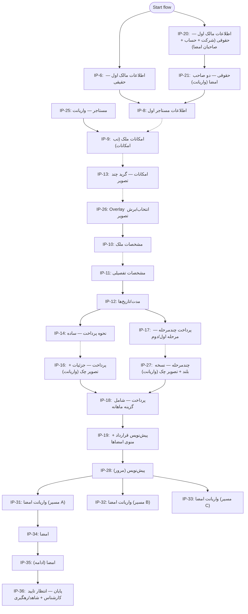

# قرارداد رهن — جمع‌بندی، گزارش، فلوها و منطق‌ها (براساس Figma + تکمیل سناریوها)

این سند، خروجی یک‌جا از:
- **بررسی عمیق Figma** برای بخش «قرارداد رهن» (Node: `191:5103`)
- **ترسیم فلوهای کامل** (با اتکا به بردارهای اتصال روی بوم + تکمیل نقاط فاقد فلش)
- **فرض‌ها/سناریوهای مختلف** و اثرشان روی مسیر
- **منطق پیاده‌سازی‌شده** به‌صورت گراف انتقال (State Machine)
- **مسیر فایل‌های پیاده‌سازی شبیه‌ساز** و نحوه اجرای آن‌ها

---

### 1) منبع و محدوده

- **Figma**: فایل طراحی `Ddw0j8mxfBTPSycl1pGxsy` → بخش/سکشن «قرارداد رهن» با Node: `191:5103`
- **Frames (نمونه‌های کلیدی)** که از متادیتا استخراج شد:
  - مالک: `IP-6` (حقیقی)، `IP-20` و `IP-21` (حقوقی + صاحبان امضا)
  - مستاجر: `IP-8` (و واریانت `IP-25`)
  - ملک: `IP-9`, `IP-13`, `IP-26`, `IP-10`, `IP-11`
  - تاریخ/مدت: `IP-12`
  - پرداخت: `IP-14`, `IP-16`, `IP-17`, `IP-27`, `IP-18`
  - پیش‌نویس/امضا: `IP-19`, `IP-28`, `IP-31/32/33`, `IP-34`, `IP-35`, `IP-45`
  - پایان: `IP-36` (پیام «در انتظار تایید کارشناس» + توضیح شاهد/کد رهگیری)

---

### 2) اسکلت مشترک صفحات (UI Pattern)

تقریباً تمام فریم‌های موبایل، یک اسکلت ثابت دارند:
- **System Bar**
- **Top bar**
- **Progress bar** (`Component 1/progress bar`)
- محتوای اصلی (فرم/تب/لیست)
- **Fixed Button** پایین صفحه (ارتفاع ≈ `65px`)

این الگو هم در طراحی Figma دیده می‌شود و هم در پیاده‌سازی شبیه‌ساز رعایت شده است.

---

### 3) بردارهای رسمی اتصال (منبع حقیقت برای مسیرهای قطعی)

این اتصالات به‌صورت `vector` روی بوم ثبت شده‌اند (یعنی «قطعی»):

- `Start flow → IP-6`
- `Start flow → IP-20`
- `IP-6 → IP-8`
- `IP-21 → IP-8`
- `IP-25 → IP-9`
- `IP-26 → IP-10`
- `IP-11 → IP-12`
- `IP-12 → IP-14`
- `IP-12 → IP-17`
- `IP-16 → IP-18`
- `IP-27 → IP-18`
- `IP-18 → IP-19`
- `IP-19 → IP-28`
- `IP-28 → IP-31`
- `IP-28 → IP-32`
- `IP-28 → IP-33`
- `IP-31 → IP-34`
- `IP-34 → IP-35`
- `IP-35 → IP-36`

> نکته: فریم‌های دیگری هم وجود دارند که اتصال‌شان در متادیتا به شکل بردار نیامده (یا به‌صورت یادداشت/قرارداد محصولی بوده)؛ آن‌ها در بخش «تکمیل منطقی» پوشش داده شده‌اند.

---

### 4) دیاگرام فلو (ترکیب قطعی + تکمیل منطقی نقاط بدون فلش)

در این دیاگرام:
- خطوط **سخت** = اتصالات برداری (قطعی)
- خطوط **نقطه‌چین** = تکمیل منطقی در نقاطی که بردار ثبت نشده ولی از ترتیب UI/محتوا و مسیرهای موجود نتیجه می‌شود



---

### 5) نقاط ابهام / نقص در فایل طراحی (و نحوه تکمیل)

این موارد در متادیتا مشاهده شد و برای «فلو کامل» باید تکمیل/تصمیم محصولی گرفته شود:

- **`IP-20` به مستاجر**: در بردارها `Start → 20` هست، اما اتصال صریح `20 → 8` دیده نشد؛ در عوض `21 → 8` و `6 → 8` ثبت شده.
  - **تکمیل پیشنهادی**: `20` اگر تعداد امضا = ۱ → مستقیم `8`؛ اگر = ۲ → ابتدا `21` سپس `8`.

- **`IP-8 → IP-9`**: بردار صریح ندارد، اما چون `25 → 9` وجود دارد و مسیر ملک بعد از مستاجر منطقی است:
  - **تکمیل پیشنهادی**: `8 → 9` به‌عنوان ادامهٔ استاندارد.

- **مسیر عکس‌ها (`9 → 13 → 26`)**: در بردارها صریح نیامده، اما وجود `26 → 10` نشان می‌دهد `26` مرحلهٔ overlay برای تصویر است.
  - **تکمیل پیشنهادی**: `9` (ورود به امکانات) → `13` (چندتصویر) → `26` (crop) → `10`.

- **واریانت‌های پرداخت (`14 → 16` و `17 → 27`)**: در بردارها «بعد از ۱۴» و «بعد از ۱۷» اتصال قطعی نیامده، ولی `16 → 18` و `27 → 18` قطعی است.
  - **تکمیل پیشنهادی**: `16` و `27` به‌عنوان صفحات اختیاری/پُرجزئیات که بسته به سناریو در مسیر می‌آیند.

- **Sticky noteها** روی بوم وجود دارند اما متن‌شان در خروجی متادیتا نیامده؛ اگر متن یادداشت‌ها مهم باشد باید در خود Figma خوانده و به سند اضافه شوند.

---

### 6) فرض‌ها/سناریوها (برای پوشش همه حالت‌ها)

این‌ها متغیرهایی هستند که مسیر را تغییر می‌دهند (در شبیه‌ساز هم پیاده شده‌اند):

- **`ownerEntry`**: ورود از `IP-6` (حقیقی) یا `IP-20` (حقوقی)
- **`legalSignatoryCount`**: حقوقی با ۱ یا ۲ صاحب امضا (۱ → مستقیم، ۲ → عبور از `IP-21`)
- **`skipTenantScreen`**: رد کردن صفحهٔ مستاجر (برای سناریوهای دادهٔ از پیش تکمیل‌شده/کوتاه‌سازی مسیر)
- **`paymentBranch`**: پس از `IP-12` مسیر ساده (`IP-14`) یا چندمرحله (`IP-17`)
- **`insertPay16After14`**: درج `IP-16` به‌عنوان صفحهٔ جزئیات/تصویر چک
- **`insertPay27After17`**: درج `IP-27` به‌عنوان نسخهٔ بلند چندمرحله
- **`requireDraft28`**: الزام عبور از `IP-28` بعد از `IP-19` (مطابق بردار قطعی `19→28`)
- **`signVariant`**: انتخاب یکی از مسیرهای موازی `IP-31/32/33`
- **`showSign45`**: نمایش واریانت امضا `IP-45` قبل از پایان

---

### 7) منطق‌ها (State Machine / گراف انتقال)

منطق، به‌صورت تابع «مرحله بعدی» تعریف می‌شود و کاملاً تابع فرض‌هاست:

**گره‌ها**: `start`, `owner_natural`, `owner_legal`, `owner_legal_2`, `tenant`, `amenities_*`, `specs_*`, `dates_12`, `pay_*`, `draft_*`, `sign_*`, `success_36`

**قانون کلی**:
- اگر اتصال Figma قطعی باشد، همان مسیر «پیش‌فرض» است.
- اگر اتصال قطعی موجود نباشد، با فرض‌ها/منطق محصولی و ترتیب محتوایی تکمیل می‌شود.

نمونه شبه‌کد:

```text
start:
  if ownerEntry == legal -> owner_legal
  else -> owner_natural

owner_natural:
  if skipTenantScreen -> amenities_9
  else -> tenant

owner_legal:
  if legalSignatoryCount == 2 -> owner_legal_2
  else -> (skipTenantScreen ? amenities_9 : tenant)

tenant -> amenities_9 -> amenities_13 -> amenities_crop -> specs_10 -> specs_11 -> dates_12

dates_12:
  if paymentBranch == multi -> pay_17
  else -> pay_14

pay_14:
  if insertPay16After14 -> pay_16
  else -> pay_18

pay_17:
  if insertPay27After17 -> pay_27
  else -> pay_18

pay_18 -> draft_19 -> (requireDraft28 ? draft_28 : sign_gate) -> sign_34 -> sign_35
sign_35 -> (showSign45 ? sign_45 : success_36) -> end
```

---

### 8) پیاده‌سازی تعاملی (شبیه‌ساز فلو)

برای «پیاده‌سازی فلو با فرض‌های مختلف»، یک شبیه‌ساز HTML ساخته شده است:

- **مسیر فایل**: `E:\CTO\دیزاین\ui-design\lease-flow.html`
- ویژگی‌ها:
  - ظاهر موبایل ۳۷۵px + progress + دکمه ثابت
  - پنل «فرض‌های جریان» برای تغییر شاخه‌ها
  - `sessionStorage` برای نگه‌داری وضعیت
  - hash routing مثل `#pay_17` برای لینک مستقیم مرحله
  - خروجی JSON وضعیت با «کپی»

**اجرای شبیه‌ساز** (در پوشه `E:\CTO\دیزاین\ui-design`):

```bash
npm run preview:lease
```

یا با هر سرور استاتیک دیگر، فایل را مستقیم باز کنید.

---

### 9) خروجی نهایی فلو (آنچه کاربر انجام می‌دهد)

خلاصهٔ مسیر استاندارد (بدون میان‌بُرهای فرضی):

1) ورود Start → مالک (`IP-6` یا `IP-20/21`)  
2) اطلاعات مستاجر (`IP-8`)  
3) امکانات ملک / تصاویر / برش (`IP-9 → IP-13 → IP-26`)  
4) مشخصات ملک (`IP-10 → IP-11`)  
5) مدت/تاریخ (`IP-12`)  
6) پرداخت (ساده `IP-14` یا چندمرحله `IP-17` + واریانت‌ها `IP-16/27` → `IP-18`)  
7) پیش‌نویس (`IP-19 → IP-28`)  
8) امضا (`IP-31/32/33 → IP-34 → IP-35`)  
9) پایان (`IP-36`) با پیام انتظار تایید کارشناس + توضیح شاهد/کد رهگیری  

---

### 10) پیشنهادهای تکمیل/تصمیم محصولی (برای نهایی‌سازی)

- تعیین تکلیف قطعی برای اتصال **۲۰ → ۸** (یا الزام عبور از ۲۱).
- مشخص کردن اینکه **IP-16** و **IP-27** در چه شرایطی وارد مسیر می‌شوند (مثلاً فقط وقتی «چک» انتخاب شده یا پرداخت چندمرحله فعال است).
- تعیین رفتار «ماهانه» در `IP-18` (اثر آن روی ساختار اقساط/اعتبارسنجی).
- اگر متن sticky noteها برای تیم مهم است، استخراج مستقیم از Figma و افزودن به این سند.

