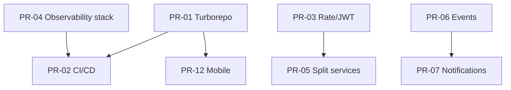

# نقشهٔ راه دگرگونی سکوی Amline_namAvaran

این سند برای هر محور **وضعیت فعلی**، **طرح اصلاح**، **محتوای PR پیشنهادی**، **وابستگی** و **معیار پذیرش** را مشخص می‌کند. اجرای کامل در چند فاز و چند PR مستقل است.

---

## Critical

### 1. مهاجرت مونوریپو به Turborepo یا NX

**وضعیت فعلی**

- چند اپ جدا با هر کدام `package-lock.json` خود: `admin-ui`, `amline-ui`, `site`, `seo-dashboard`, `packages/amline-ui-core`, به‌علاوه پروژه‌های جانبی.
- ریشهٔ مخزن **بدون** `package.json` یکپارچه؛ CI هر پکیج را در `working-directory` جدا می‌سازد.
- وابستگی بین پکیج‌ها محدود است؛ کش و ترتیب build در CI تکراری است.

**طرح اصلاح**

- **فاز A**: یک `package.json` و `turbo.json` در ریشه؛ تعریف `workspaces` و **یک** lockfile ریشه (یا مهاجرت به pnpm workspace).
- **فاز B**: وظایف `build` / `lint` / `test` در Turbo با `outputs` صحیح (`.next`, `dist`).
- **NX** فقط اگر نیاز به graph عمیق‌تر، مولد کد، یا ماژول‌های federated باشد؛ برای این مخزن فعلاً **Turborepo** سبک‌تر است.

**PR پیشنهادی**

- `PR-01a`: اسناد + نمونه در `docs/platform-transformation/artifacts/`.
- `PR-01b`: ریشهٔ مونوریپو + حذف lockهای تودرتو + به‌روزرسانی CI برای `npm ci` در ریشه و `turbo run build`.

**وابستگی**: ندارد (اولین زیرساخت).

**معیار پذیرش**: `turbo run build` در CI سبز؛ همهٔ اپ‌های هدف artifact تولید کنند.

---

### 2. CI/CD کامل (build, test, deploy, versioning)

**وضعیت فعلی**

- `.github/workflows/ci.yml`: بک‌اند (lint, test, mypy اختیاری)، inventory فرانت، E2E `amline-ui`، build Docker چند سرویس، job `deploy` با **placeholder** (`echo`).
- `deploy-staging.yml`: استیجینگ واقعی برای admin-ui + site.

**طرح اصلاح**

- اتصال job `deploy` production به همان الگوی استیجینگ (SSH/k8s) یا حذف آن تا فقط workflowهای صریح بمانند.
- گیت‌هاب Environments + required checks روی `main`.
- job نسخه‌دهی تگ/artifact (طبق [VERSIONING.md](./VERSIONING.md)).

**PR پیشنهادی**

- `PR-02a`: سخت‌سازی CI (fail on lint در admin-ui، `npm ci` به‌جای `npm install` جایی که lock هست).
- `PR-02b`: deploy production قابل اجرا + مستند secrets.

**وابستگی**: PR-01b برای یکپارچه‌سازی فرانت اختیاری ولی توصیه‌شده.

**معیار پذیرش**: مسیر اصلی تا production بدون دست‌ویرانهٔ نمایشی؛ rollback مستند.

---

### 3. Rate Limiting و امنیت OTP/JWT

**وضعیت فعلی**

- `app/core/ops.py`: Prometheus، هدرهای امنیتی، **محدودیت نرخ درون‌فرایندی** برای مسیر `POST .../admin/otp/send` (بر پایه IP).
- OpenTelemetry اختیاری با `OTEL_EXPORTER_OTLP_ENDPOINT` (`app/core/otel_setup.py`).
- مسیرهای auth در `app/api/v1/auth_routes.py` شامل mock token؛ JWT تولیدی باید در لایهٔ واقعی auth بررسی شود.

**طرح اصلاح**

- Redis (یا سرویس مشابه) + **SlowAPI** یا middleware مشترک برای `/admin/login`، ارسال OTP، و endpointهای حساس.
- سیاست JWT: انقضا، refresh rotation، denylist برای logout (Redis).
- مرور `OAuth2PasswordBearer` در `app/routes/auth.py` و یکپارچه‌سازی با `/api/v1`.

**PR پیشنهادی**

- `PR-03a`: Redis + rate limit سراسری (قابل خاموش در dev).
- `PR-03b`: سخت‌سازی JWT و قرارداد OTP (طول عمر، تعداد تلاش، lock پس از N خطا).

**وابستگی**: زیرساخت Redis در compose/k8s.

**معیار پذیرش**: تست‌های واحد/یکپارچگی برای 429 و انقضای OTP؛ absence of mock token در محیط production.

---

### 4. Observability (OpenTelemetry + Prometheus + Grafana)

**وضعیت فعلی**

- `prometheus-client`، `/metrics` (با `AMLINE_METRICS_ENABLED=1`)، middleware شمارش درخواست.
- بسته‌های OTLP در `requirements.txt`؛ فعال‌سازی با متغیر محیط.

**طرح اصلاح**

- استقرار **Prometheus** (scrape بک‌اند)، **Grafana** (dashboard آماده)، **OTel Collector** (اختیاری) برای ارسال trace به Jaeger/Tempo.
- مستند runbook برای alertهای پایه (5xx rate، latency).

**PR پیشنهادی**

- `PR-04`: افزودن `infra/observability/*` (انجام شده در همین مجموعهٔ تغییرات) + به‌روزرسانی `docs/API_DOCS.md` یا لینک به README observability.

**وابستگی**: کم؛ فقط Docker برای dev/staging.

**معیار پذیرش**: با `docker compose up` در پوشهٔ observability، متریک و داشبورد قابل مشاهده باشد.

---

## Major

### 5. جداسازی Backend Monolith (Auth، Notifications، Wallet)

**وضعیت فعلی**

- یک اپ FastAPI در `backend/backend` با ماژول‌های متعدد.

**طرح اصلاح**

- استخراج **قرارداد API** (OpenAPI) و DB per service به‌تدریج؛ ابتدا **ماژول‌های مجازی** (package boundaries) سپس سرویس جدا.
- Auth اولویت اول به‌خاطر مرز امنیتی.

**PR**: `PR-05` اسپایک + `docs/adr/0001-service-boundaries.md`؛ سپس PRهای جدا برای استخراج.

**وابستگی**: PR-03، messaging.

---

### 6. Event-Driven با Redis Streams یا NATS

**وضعیت فعلی**

- `temporalio` در requirements (گردش کار)؛ رویداد دامنهٔ یکنواخت ممکن است نباشد.

**طرح**

- تعریف **رویدادهای دامنه** (contract.signed, payment.captured)؛ پل Temporal ↔ bus.
- انتخاب: Redis Streams برای سادگی عملیاتی؛ NATS برای چند دیتاسنتر.

**PR**: `PR-06` قرارداد رویداد + publisher تستی.

---

### 7. Notification Service مستقل

**طرح**: خروج از monolith برای کانال‌های SMS/push/email؛ صف ورودی از PR-06.

**PR**: `PR-07` سرویس کوچک + adapter در monolith.

**وابستگی**: PR-06.

---

### 8. Search Service (Meilisearch / Elastic)

**وضعیت فعلی**

- `app/integrations/meilisearch_listings.py` وجود دارد — یکپارچه‌سازی جزئی.

**طرح**

- سرویس جستجو به‌عنوان BFF یا worker sync از DB؛ شاخص‌گذاری idempotent.

**PR**: `PR-08` مستند معماری + گسترش sync.

---

## Enhancement

### 9. یکپارچه‌سازی Next.js و React

**وضعیت فعلی**

- `site`: Next **15.0.0** + React 18.3.
- `amline-ui`: Next **14.2.5** + React 18.3.

**طرح**

- ارتقای `amline-ui` به Next 15 هم‌تراز `site` پس از تست E2E/Playwright؛ یا هر دو روی LTS توافقی.

**PR**: `PR-09` با changelog وابستگی‌ها.

---

### 10. تست‌های جامع (integration + e2e)

**وضعیت فعلی**

- pytest بک‌اند؛ Playwright برای `amline-ui`؛ admin-ui دارای `test:e2e` در package.

**طرح**

- integration با DB تست (Postgres testcontainer یا sqlite محدود)؛ گسترش e2e به admin-ui در CI.

**PR**: `PR-10`.

---

### 11. بهبود Wallet و Settlement

**طرح**

- مدل دفتر کل (ledger)، idempotency برای تراکنش، گزارش تسویه.

**PR**: `PR-11` پس از تعریف نیاز محصول.

---

### 12. Mobile App (React Native / Expo)

**طرح**

- مخزن جدا یا `apps/mobile` در مونوریپو پس از PR-01؛ auth و API مشترک.

**PR**: `PR-12` اسکلت Expo + قرارداد env.

---

## جمع‌بندی وابستگی‌ها (خلاصه)

---

## وضعیت «اجرای تغییرات» در این تحویل

| محور | اجرا در مخزن |
|------|----------------|
| 1 | نمونه artifact؛ بدون تغییر lock ریشه (PR بعدی) |
| 2 | مستند؛ deploy هنوز placeholder در ci.yml |
| 3 | مستند؛ کد فعلی محدودیت OTP دارد |
| 4 | **docker-compose + prometheus.yml + README** |
| 5–8, 10–12 | مستند + PR checklist |

برای **PRهای مستقل روی GitHub** از [GITHUB_BRANCH_AND_PR.md](./GITHUB_BRANCH_AND_PR.md) استفاده کنید.
