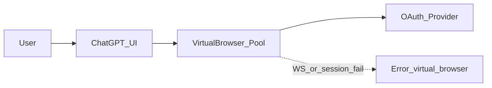

# Runbook: ChatGPT virtual browser and connector setup (Figma / GitHub)

Use this when you see **Could not connect to virtual browser**, **Something went wrong with setting up the connection**, or **GitHub: Setup incomplete** while connecting apps in ChatGPT.

## What is failing

ChatGPT may open a **remote virtual browser** (banner: *You're controlling the browser*). That session depends on OpenAI infrastructure and a stable **WebSocket** (or similar) path. If it never starts or drops, **OAuth never finishes** and connectors stay incomplete.

This is **not fixed by application code** in this repo; follow the steps below in the **browser and network** you use for ChatGPT.

## Quick links

| Resource | URL |
|----------|-----|
| ChatGPT Connectors (deep link) | https://chatgpt.com/#settings/Connectors |
| OpenAI status | https://status.openai.com |
| OpenAI: Connected apps | https://help.openai.com/en/collections/12923329-connected-apps |
| Figma: ChatGPT integration | https://help.figma.com/hc/en-us/articles/35326636109975-Use-ChatGPT-with-Figma |

From repo root (Windows), you can open these in the default browser:

```powershell
.\scripts\open-chatgpt-support-resources.ps1
```

---

## 1) Bypass the chat / virtual-browser flow

- [ ] Do **not** start connector setup from a chat flow that opens **browser control** / virtual browser.
- [ ] Go to **Profile → Settings → Apps** (or **Connectors**).
- [ ] Use **Connect** next to **Figma** or **GitHub** from that settings list.
- [ ] If the same virtual browser UI still appears, continue with sections 2–5 (network/browser/session).

---

## 2) Browser hardening

- [ ] Use an updated **Chrome** or **Edge**.
- [ ] Test with a **clean profile** or **Incognito / InPrivate** with **no extensions**.
- [ ] Temporarily disable **ad blockers** and **privacy** extensions (uBlock, Ghostery, etc.).
- [ ] Allow **third-party cookies** for ChatGPT / OpenAI domains where required for OAuth.
- [ ] Ensure **pop-ups** are not blocked for `chatgpt.com` and the OAuth provider.

---

## 3) Network matrix

- [ ] Retry **without VPN**.
- [ ] Retry with a **stable VPN** (fixed region, minimal disconnects), if you normally need one.
- [ ] If possible, try another **network** (e.g. mobile hotspot) to rule out ISP filtering.

---

## 4) DevTools verification

On the ChatGPT tab:

- [ ] **Network → WS**: note any WebSocket **failed**, immediate **close**, or repeated drops; record **time (with timezone)**.
- [ ] **Console**: note CORS, blocked scripts, or extension-related errors.

Keep these notes for support if the issue persists.

---

## 5) Session reset

- [ ] **Sign out** of ChatGPT completely.
- [ ] Clear **site data** / cookies for `chatgpt.com` (and `openai.com` if needed).
- [ ] Sign in again.
- [ ] In separate tabs, sign in to **https://www.figma.com** and **https://github.com** with the accounts you want linked.
- [ ] Retry **Connect** from ChatGPT Settings.

---

## 6) Escalation (OpenAI / product limits)

- [ ] Check **https://status.openai.com** for connector or ChatGPT incidents.
- [ ] If the error persists across **two browsers**, **two networks**, and a **clean profile**, open **ChatGPT Help / support** with: exact error text, time, and (if possible) HAR or Network export from DevTools.
- [ ] **Figma**: per Figma’s docs, ChatGPT integration may be **unavailable in the EU**; if your IP is detected as EU, Figma may not complete even when the virtual browser works. Treat GitHub separately.

---

## Flow (reference)


