# 📘 سند جامع پلتفرم Amline

**نسخه:** ۱.۰ — Production Ready  
**تاریخ:** فروردین ۱۴۰۵  
**وضعیت:** هم‌راستا با کد ریپو `main` — برگرفته از SSOT  
**مخاطب:** تیم توسعه (فرانت، بک‌اند، DevOps)، تیم QA، تیم محصول، تیم حقوقی  
**مرجع اصلی:** [`docs/AMLINE_MASTER_SPEC.md`](../docs/AMLINE_MASTER_SPEC.md)، [`docs/Amline_Complete_Master_Spec_v2.md`](../docs/Amline_Complete_Master_Spec_v2.md)، [`docs/ARCHITECTURE_CONTRACT_PLATFORM_PRODUCTION.md`](../docs/ARCHITECTURE_CONTRACT_PLATFORM_PRODUCTION.md)

---

## 📑 فهرست مطالب

| # | بخش |
|---|------|
| ۱ | تعریف محصول و چشم‌انداز |
| ۲ | معماری کلان سیستم |
| ۳ | نقش‌ها و دسترسی‌ها (RBAC) |
| ۴ | State Machine قرارداد |
| ۵ | انواع قراردادها — مدل داده و فلو |
| ۶ | سناریوهای امضا (S1–S5) |
| ۷ | سناریوهای پرداخت کمیسیون (P1–P4) |
| ۸ | فلوهای کامل یوزر |
| ۹ | پنل ادمین — فلوها و APIها |
| ۱۰ | سیستم حل اختلاف (Dispute) |
| ۱۱ | امنیت، ممیزی و رصدپذیری |
| ۱۲ | نقشه راه پیاده‌سازی |

---

## 🎯 بخش ۱: تعریف محصول و چشم‌انداز

### ۱.۱ جمله یک‌خطی

> **Amline** یک سوپراپ تخصصی املاک و قرارداد آنلاین است که مسیر کامل «آگهی → لید → بازدید → **هر نوع قرارداد ملکی** → امضای دیجیتال → پرداخت → کد رهگیری» را برای مردم، مشاوران و آژانس‌ها یکپارچه و آنلاین مدیریت می‌کند.

### ۱.۲ سه لایه اصلی پلتفرم

```
┌──────────────────────────────────────────────────────────┐
│                    amline.ir (Landing)                    │
│         SEO · معرفی · دانلود اپ · ورود/ثبت‌نام           │
└──────────────────────────────────────────────────────────┘
                            │
          ┌─────────────────┼──────────────────┐
          ▼                                     ▼
┌──────────────────┐                 ┌──────────────────────┐
│ app.amline.ir    │                 │ admin.amline.ir       │
│ پنل یکپارچه      │                 │ پنل داخلی             │
│ مشاور + کاربر   │                 │ کارشناس · ادمین · مالی│
└──────────────────┘                 └──────────────────────┘
```

### ۱.۳ انواع قراردادهای پشتیبانی‌شده

| نوع | کد (SSOT) | نقش‌های طرفین | وضعیت |
|------|-----------|---------------|--------|
| رهن و اجاره | `RENT` | `LANDLORD` / `TENANT` | ✅ موجود |
| خرید و فروش | `SALE` | `SELLER` / `BUYER` | ✅ موجود |
| معاوضه | `EXCHANGE` | `EXCHANGER_FIRST` / `EXCHANGER_SECOND` | ✅ موجود |
| مشارکت در ساخت | `CONSTRUCTION` | `LAND_OWNER` / `CONTRACTOR` | ✅ موجود |
| پیش‌فروش آپارتمان | `PRE_SALE` | `DEVELOPER` / `BUYER` | ✅ موجود |
| اجاره به شرط تملیک | `LEASE_TO_OWN` | `LESSOR` / `LESSEE` | ✅ موجود |

---

## 🏗️ بخش ۲: معماری کلان سیستم

### ۲.۱ دیاگرام کلان (C4 سطح ۲)

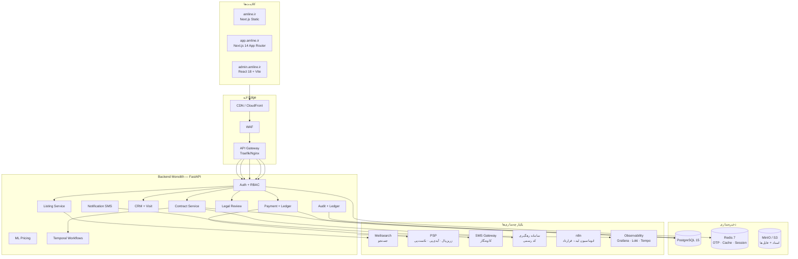

### ۲.۲ Stack فنی

| لایه | تکنولوژی | دلیل انتخاب |
|------|-----------|------------|
| فرانت کاربر | Next.js 14 App Router + Tailwind | SSR، PWA، SEO |
| پنل ادمین | React 18 + Vite + TanStack Query | سرعت، کامپوننت‌های آماده |
| بک‌اند | FastAPI (Python 3.11) + SQLAlchemy 2 | async، نوع‌گذاری قوی |
| پایگاه داده | PostgreSQL 15 + Alembic | قابلیت اطمینان، مهاجرت ساختاریافته |
| کش / OTP | Redis 7 | سرعت، TTL، Rate Limit |
| فایل | MinIO / S3 | اسناد قرارداد، فایل‌های ملک |
| جستجو | Meilisearch | جستجوی آگهی‌ها |
| Workflow | Temporal | گردش‌کارهای طولانی‌مدت |
| لاگ / متریک | Grafana + Loki + Tempo + Prometheus | رصدپذیری کامل |
| پیامک | کاوه‌نگار (+ fallback mock در dev) | OTP، اعلان‌ها |

### ۲.۳ مسیرهای API

| محیط | پیشوند | توضیح |
|-------|--------|--------|
| Production | `/api/v1/...` | مسیر canonical |
| Legacy (سازگاری) | `/...` (بدون پیشوند) | سازگاری با mock قدیمی |
| Dev Mock | `http://localhost:8080` | بدون DB، فقط توسعه |

---

## 👥 بخش ۳: نقش‌ها و دسترسی‌ها (RBAC)

### ۳.۱ نقش‌های کاربری

| نقش | کد | توضیح |
|------|-----|--------|
| کاربر عادی | `USER` | مشاهده، تنظیم قرارداد برای خود، امضا |
| مشاور | `AGENT` | همه دسترسی‌های USER + مدیریت لید، آگهی، امضای کمکی (کاتب) |
| پشتیبان فنی | `SUPPORT_TECH` | مدیریت کاربران، مشاهده خطاها |
| کارشناس حقوقی | `SUPPORT_LEGAL` | تأیید / رد قراردادها، بررسی اختلافات |
| مدیر مالی | `FINANCE` | مدیریت پرداخت‌ها، تسویه، گزارش مالی |
| سوپرادمین | `SUPER_ADMIN` | همه دسترسی‌ها |

> **نکته مهم:** نقش «کاتب» در سیستم به‌عنوان نقش مجزا وجود ندارد. مشاور (`AGENT`) می‌تواند به‌عنوان کاتب عمل کند و با `signature_method=AGENT_OTP` امضای کمکی انجام دهد.

### ۳.۲ مجوزهای کلیدی

| مجوز | کد | نقش‌های مجاز |
|------|-----|--------------|
| ایجاد قرارداد | `contract:create` | USER, AGENT |
| امضای مستقل | `signature:self` | USER, AGENT |
| امضای کمکی (کاتب) | `signature:assist` | AGENT |
| تأیید قرارداد | `contract:approve` | SUPPORT_LEGAL |
| مشاهده همه قراردادها | `contract:read:all` | SUPPORT_LEGAL, FINANCE, SUPER_ADMIN |
| مدیریت پرداخت | `payment:manage` | FINANCE, SUPER_ADMIN |
| مدیریت کاربران | `user:manage` | SUPPORT_TECH, SUPER_ADMIN |
| export حقوقی | `legal:export` | SUPPORT_LEGAL, SUPER_ADMIN |

### ۳.۳ دیاگرام نقش‌ها

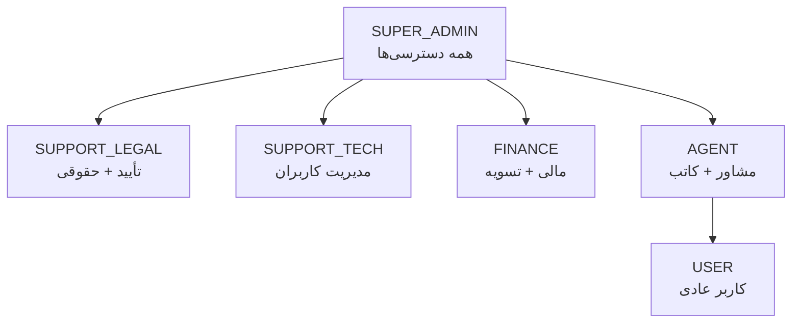

---

## 🧠 بخش ۴: State Machine قرارداد

### ۴.۱ وضعیت‌های کامل

| وضعیت | معنا | ورودی |
|--------|------|--------|
| `draft` | پیش‌نویس؛ قابل ویرایش | ایجاد قرارداد |
| `awaiting_parties` | دعوت طرف‌ها، تکمیل هویت | ارسال دعوت |
| `signing_in_progress` | حداقل یک طرف در انتظار امضا | شروع فرایند امضا |
| `signed_pending_payment` | امضاها کامل؛ منتظر پرداخت کمیسیون | تکمیل امضاها |
| `payment_partial` | یک طرف پرداخت کرده | callback PSP |
| `payment_complete` | هر دو طرف پرداخت کردند | verify PSP |
| `legal_review` | در صف بررسی کارشناس حقوقی | enqueue |
| `registry_submitted` | ارسال به سامانه رهگیری | adapter |
| `registry_pending` | منتظر کد رهگیری رسمی | poll/webhook |
| `active` | قرارداد نهایی شده + کد رهگیری | دریافت کد |
| `completed` | اجرای تعهدات تمام شد | رویداد دامنه |
| `cancelled` | لغو مجاز | user / admin / SLA |
| `expired` | SLA امضا یا پرداخت منقضی شد | scheduler |
| `dispute_open` | اختلاف فعال؛ مبالغ فریز | user / admin |
| `compensating` | در حال برگشت وجه (Saga) | شکست در Saga |
| `failed_terminal` | غیرقابل ادامه بدون مداخله انسانی | چند شکست متوالی |

### ۴.۲ دیاگرام State Machine کامل

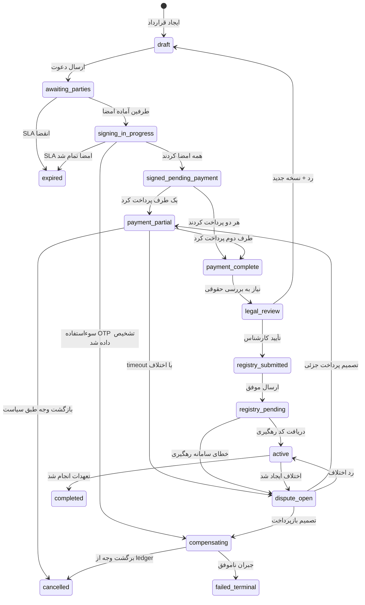

### ۴.۳ SLA و Timeout

| رویداد | مهلت پیش‌فرض | اقدام پس از انقضا |
|--------|-------------|------------------|
| دعوت امضا | ۷۲ ساعت | یادآوری ۲۴h و ۴۸h؛ سپس `expired` |
| مهلت پرداخت هر طرف | ۴۸ ساعت | یادآوری؛ سپس `payment_partial` یا dispute |
| پاسخ سامانه رهگیری | ۵ روز کاری | escalation به ادمین |
| رسیدگی به اختلاف داخلی | ۷۲ ساعت | escalation |

---

## 📋 بخش ۵: انواع قراردادها — مدل داده و فلو

### ۵.۱ ساختار مشترک قرارداد

```yaml
Contract:
  id: UUID
  ssot_kind: RENT | SALE | EXCHANGE | CONSTRUCTION | PRE_SALE | LEASE_TO_OWN
  status: string  # طبق State Machine بخش ۴
  substate: string?  # SLA / صف حقوقی / انتظار امضا
  created_at: datetime
  created_by_user_id: UUID  # کاتب (مشاور یا کاربر عادی)
  parties: List[Party]
  witnesses: List[Witness]
  terms: ContractTerms  # پلی‌مورفیک بر اساس ssot_kind
  commissions: List[Commission]
  external_refs:
    khodnevis_id: string?
    katib_id: string?
    tracking_code: string?  # کد رهگیری رسمی
```

```yaml
Party:
  id: UUID
  contract_id: UUID
  party_role: string  # بر اساس نوع قرارداد
  person_type: NATURAL | LEGAL
  natural_person_detail:
    first_name, last_name, national_id, phone
  legal_person_detail:
    company_name, registration_number, authorized_signatory
  signed: boolean
  signature_status: PENDING | SIGNED_BY_OTP | REJECTED
  signature_method: SELF_OTP | AGENT_OTP | ADMIN_OTP | AUTO
  agent_user_id: UUID?  # در صورت امضا توسط کاتب (AGENT_OTP)
```

---

### ۵.۲ رهن و اجاره (RENT)

**نقش‌های طرفین:** `LANDLORD` (موجر) / `TENANT` (مستأجر)

**مدل داده terms:**
```yaml
RentTerms:
  property_address: string
  rent_amount: int          # اجاره ماهیانه (ریال)
  deposit_amount: int       # مبلغ رهن (ریال)
  contract_duration_months: int
  start_date: date
  end_date: date
  special_conditions: string?
```

**فلو کاربری:**

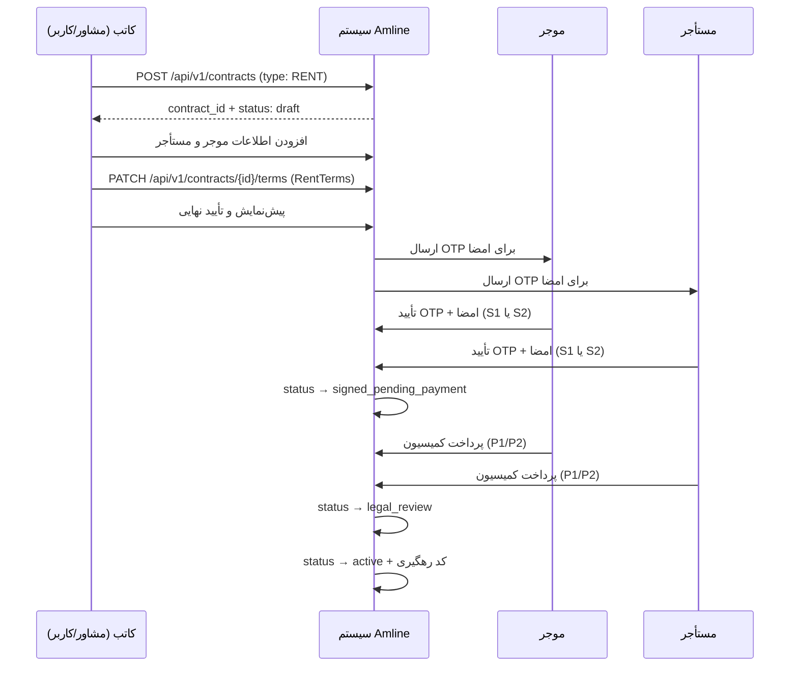

---

### ۵.۳ خرید و فروش (SALE)

**نقش‌های طرفین:** `SELLER` (فروشنده) / `BUYER` (خریدار)

**مدل داده terms:**
```yaml
SaleTerms:
  property_address: string
  total_price: int                 # مبلغ کل معامله (ریال)
  payment_plan:
    - type: ONLINE | CHEQUE | CASH
      amount: int
      due_date: date
  transfer_date: date              # تاریخ انتقال سند
  has_encumbrance: boolean         # آیا ملک در رهن بانک است؟
  encumbrance_details: string?
```

**فلو کاربری:**

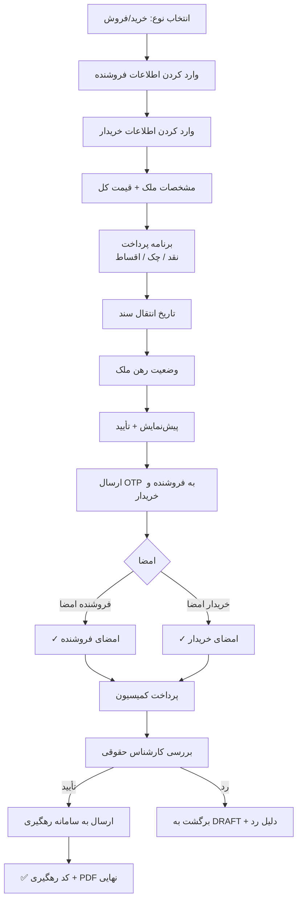

---

### ۵.۴ معاوضه (EXCHANGE)

**نقش‌های طرفین:** `EXCHANGER_FIRST` (طرف اول) / `EXCHANGER_SECOND` (طرف دوم)

**مدل داده terms:**
```yaml
ExchangeTerms:
  first_property_address: string   # ملک طرف اول
  second_property_address: string  # ملک طرف دوم
  price_difference: int            # مابه‌التفاوت (ریال)؛ صفر اگر برابر
  payment_plan:                    # برای پرداخت مابه‌التفاوت
    - type: ONLINE | CHEQUE | CASH
      amount: int
      due_date: date
```

**فلو کاربری:**

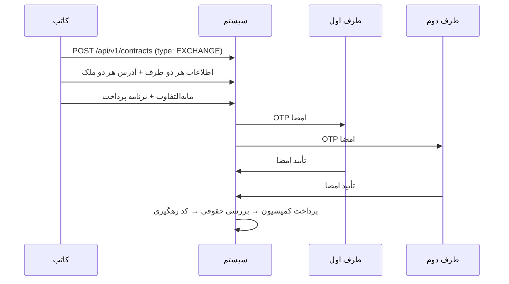

---

### ۵.۵ مشارکت در ساخت (CONSTRUCTION)

**نقش‌های طرفین:** `LAND_OWNER` (مالک زمین) / `CONTRACTOR` (سازنده)

**مدل داده terms:**
```yaml
ConstructionTerms:
  land_address: string
  land_owner_name: string
  contractor_name: string
  land_owner_share_percent: int    # مثلاً ۴۰٪
  contractor_share_percent: int    # مثلاً ۶۰٪
  estimated_completion_date: date
  penalty_for_delay: int           # جریمه روزانه (ریال)
```

**فلو کاربری:**

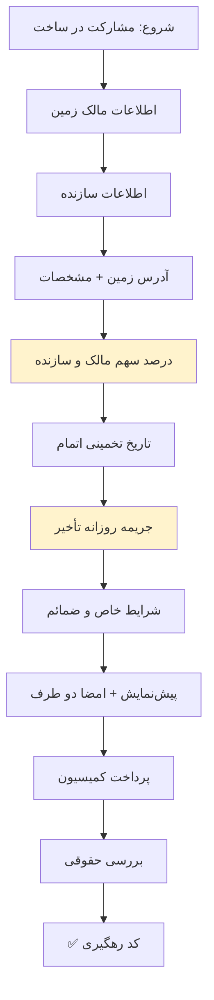

> ⚠️ **نکته حقوقی:** الزامات آیین‌نامه و شرایط اختصاصی منطقه باید در چک‌لیست جداگانه تیم حقوقی تکمیل شود.

---

### ۵.۶ پیش‌فروش آپارتمان (PRE_SALE)

**نقش‌های طرفین:** `DEVELOPER` (سازنده/انبوه‌ساز) / `BUYER` (خریدار)

**مدل داده terms:**
```yaml
PreSaleTerms:
  project_name: string
  unit_number: string
  total_price: int
  payment_schedule:
    - stage: RESERVATION | FOUNDATION | FRAMING | FINISHING | DELIVERY
      percent: int         # درصد از قیمت کل
      due_date: date
  delivery_date: date
  penalty_for_delay: int   # جریمه روزانه (ریال)
```

**فلو کاربری:**

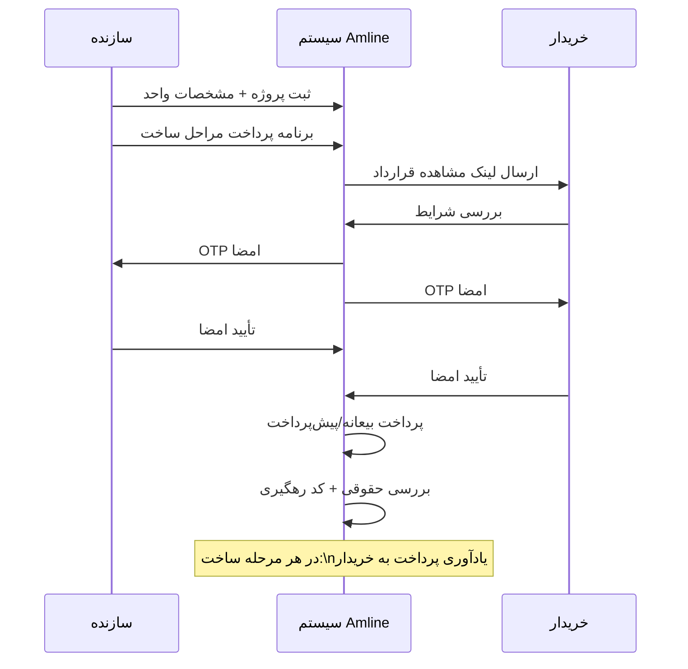

> ⚠️ **چک‌لیست انطباق:** تطبیق با قانون پیش‌فروش ساختمان، پروانه ساخت، بیمه، و حساب امانی (در صورت نیاز قانونی).

---

### ۵.۷ اجاره به شرط تملیک (LEASE_TO_OWN)

**نقش‌های طرفین:** `LESSOR` (اجاره‌دهنده) / `LESSEE` (اجاره‌گیرنده)

**مدل داده terms:**
```yaml
LeaseToOwnTerms:
  property_address: string
  monthly_rent: int                 # اجاره ماهیانه (ریال)
  contract_duration_months: int
  final_purchase_price: int         # قیمت نهایی خرید پس از دوره اجاره
  rent_credited_to_price: int       # چقدر از اجاره به قیمت می‌خورد
  purchase_option_deadline: date    # آخرین مهلت تصمیم‌گیری برای خرید
```

**فلو کاربری:**

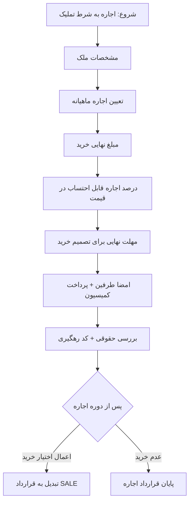

---

## ✍️ بخش ۶: سناریوهای امضا (S1–S5)

### ۶.۱ جدول سناریوها

| سناریو | نام | OTP به چه کسی می‌رسد؟ | چه کسی وارد می‌کند؟ | متد ثبت‌شده | استفاده |
|--------|------|----------------------|---------------------|------------|---------|
| **S1** | امضای مستقل | طرف قرارداد | طرف قرارداد (خودش) | `SELF_OTP` | معمول‌ترین حالت |
| **S2** | امضای کمکی — کاتب از راه دور | طرف قرارداد | کاتب (مشاور) در پنل خودش | `AGENT_OTP` + `agent_user_id` | کاتب و طرف از راه دور |
| **S3** | امضای کمکی — کاتب حضوری | طرف قرارداد | کاتب (مشاور) کنار طرف | `AGENT_OTP` + `metadata: channel=in_person` | جلسه حضوری |
| **S4** | امضا با تأیید ادمین | ادمین به کاتب | کاتب (پس از تأیید ادمین) | `ADMIN_OTP` + audit | طرف بدون موبایل |
| **S5** | امضای خودکار | — | سیستم | `AUTO` | مبلغ کمتر از آستانه + تنظیم کاربر |

### ۶.۲ دیاگرام سناریو S2 (کاتب کمکی)

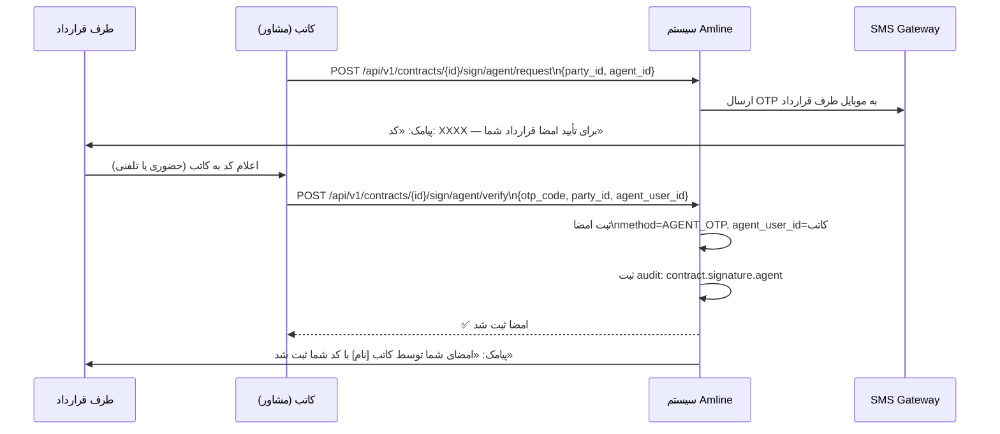

### ۶.۳ دیاگرام سناریو S4 (با تأیید ادمین)

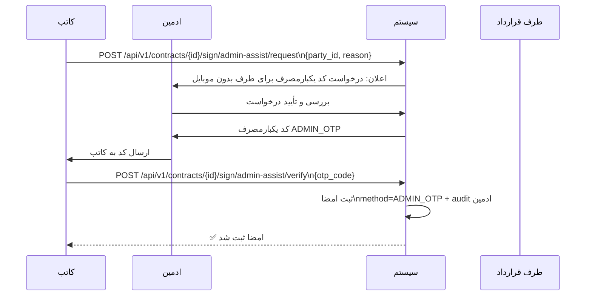

### ۶.۴ Rate Limiting و امنیت OTP

| متغیر محیطی | توضیح | پیش‌فرض |
|------------|--------|---------|
| `AMLINE_OTP_TTL_SECONDS` | انقضای OTP | ۳۰۰ ثانیه |
| `AMLINE_OTP_MAX_ATTEMPTS` | حداکثر تلاش اشتباه | ۵ بار |
| `AMLINE_OTP_LOCKOUT_SECONDS` | مدت قفل پس از خطا | ۳۰۰ ثانیه |
| `AMLINE_OTP_SEND_WINDOW_SECONDS` | پنجره محاسبه تعداد ارسال | ۳۶۰۰ ثانیه |
| `AMLINE_OTP_MAX_SENDS_PER_WINDOW` | حداکثر ارسال در پنجره | ۵ بار |

---

## 💳 بخش ۷: سناریوهای پرداخت کمیسیون (P1–P4)

### ۷.۱ جدول سناریوها

| سناریو | نام | پرداخت‌کننده | از کدام منبع؟ | مجوز لازم |
|--------|------|-------------|-------------|----------|
| **P1** | پرداخت مستقیم | طرف قرارداد | کیف پول یا درگاه PSP | — |
| **P2** | پرداخت کاتب از طرف شخص | کاتب (مشاور) | کیف پول کاتب | OTP تأیید طرف قرارداد |
| **P3** | پرداخت با وکالت | کاتب | کیف پول طرف قرارداد (وکالت قبلی) | وکالت ثبت‌شده در سیستم |
| **P4** | پرداخت دستی ادمین | ادمین مالی | درگاه داخلی / ثبت دستی | نقش FINANCE + لاگ |

### ۷.۲ فلو پرداخت split ۵۰/۵۰ (P1)

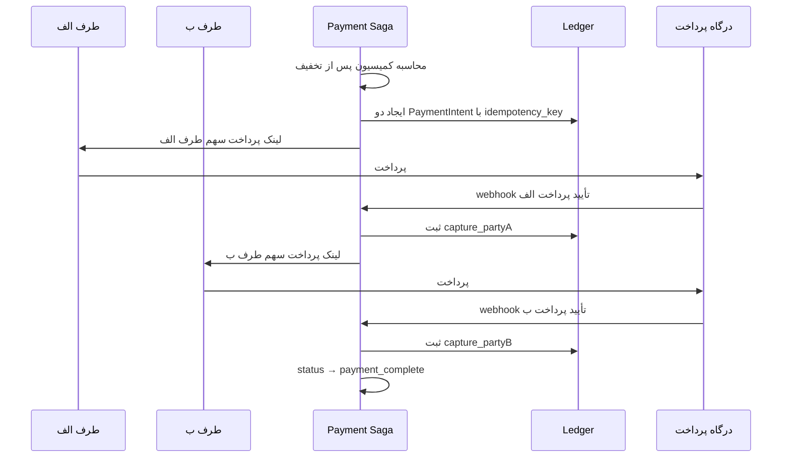

### ۷.۳ فلو P2 (کاتب از طرف طرف قرارداد)

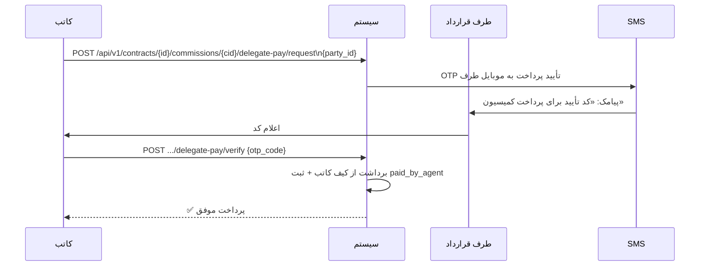

### ۷.۴ فلو ترکیبی T1 (امضای کاتب + پرداخت کاتب)

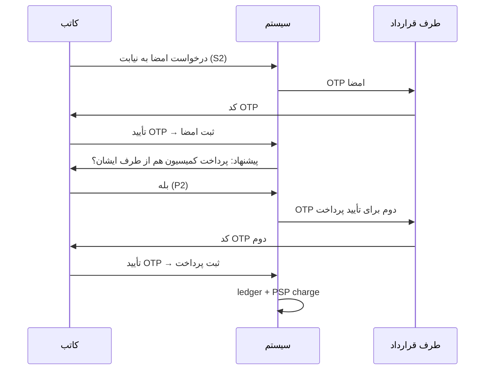

---

## 🔄 بخش ۸: فلوهای کامل یوزر

### ۸.۱ فلو کاربر عادی (مردم)

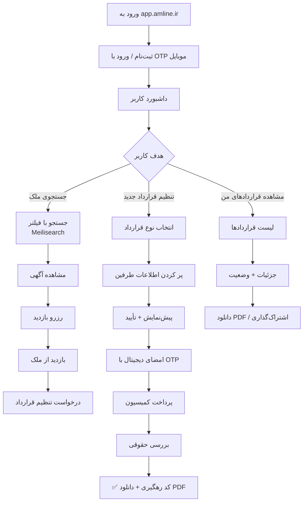

### ۸.۲ فلو مشاور (کاتب)

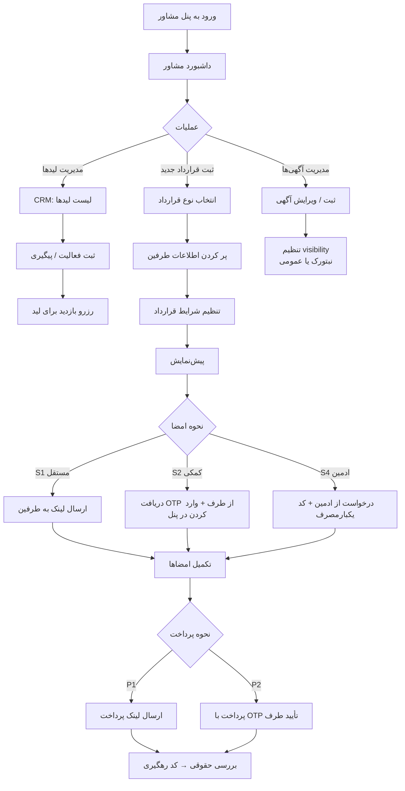

### ۸.۳ فلو کاربر دریافت دعوت امضا (لینک)

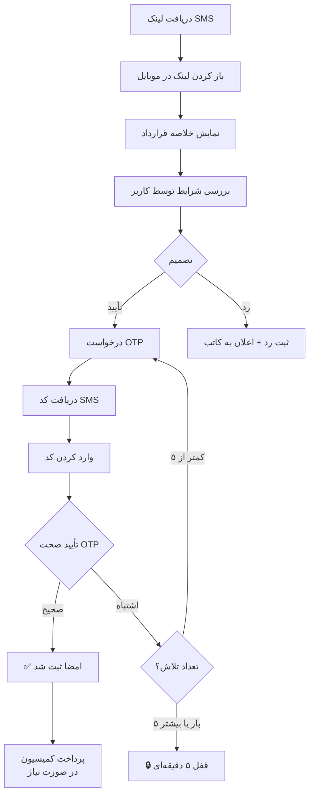

### ۸.۴ فلو ادمین حقوقی (بررسی قرارداد)

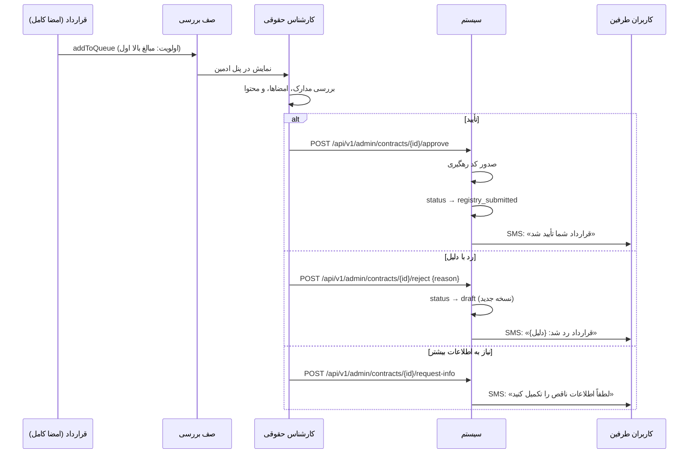

---

## 🛠️ بخش ۹: پنل ادمین — فلوها و APIها

### ۹.۱ ساختار مسیرها

```
admin.amline.ir/
├── dashboard            # داشبورد + آمار کلی
├── contracts/
│   ├── pending          # قراردادهای نیاز به بررسی حقوقی
│   ├── all              # همه قراردادها (با فیلتر)
│   ├── [id]             # جزئیات یک قرارداد
│   └── disputes         # اختلافات فعال
├── users/
│   ├── all              # همه کاربران
│   ├── agents           # مشاوران
│   ├── agencies         # آژانس‌ها
│   └── verification     # درخواست‌های احراز هویت
├── payments/
│   ├── transactions     # همه تراکنش‌ها
│   ├── manual           # پرداخت‌های دستی P4
│   └── settlements      # تسویه با آژانس‌ها
├── fraud/
│   └── alerts           # هشدارهای ریسک بالا
├── reports/
│   ├── financial        # گزارش مالی
│   └── export           # خروجی Excel/CSV
├── audit/
│   └── logs             # لاگ همه عملیات (فقط SUPER_ADMIN)
└── settings/
    ├── roles            # مدیریت نقش‌ها و مجوزها
    ├── fees             # تنظیمات کمیسیون
    └── sla              # تنظیمات SLA
```

### ۹.۲ APIهای پنل ادمین

| متد | مسیر | توضیح | نقش لازم |
|------|------|--------|----------|
| GET | `/api/v1/legal/reviews` | لیست قراردادهای نیاز به بررسی | SUPPORT_LEGAL |
| GET | `/api/v1/contracts/{id}` | جزئیات قرارداد | SUPPORT_LEGAL |
| POST | `/api/v1/legal/reviews/{id}/decide` | تأیید/رد + دلیل | SUPPORT_LEGAL |
| GET | `/api/v1/security/users/{id}/roles` | نقش‌های یک کاربر | SUPPORT_TECH |
| PUT | `/api/v1/security/users/{id}/roles` | تغییر نقش کاربر | SUPPORT_TECH |
| GET | `/api/v1/payments/intents` | لیست پرداخت‌ها | FINANCE |
| POST | `/api/v1/payments/manual/confirm` | تأیید پرداخت دستی P4 | FINANCE |
| GET | `/api/v1/audit/logs` | مشاهده لاگ‌های ممیزی | SUPER_ADMIN |
| GET | `/api/v1/contracts/{id}/disputes` | اختلافات یک قرارداد | SUPPORT_LEGAL |
| POST | `/api/v1/contracts/{id}/disputes/{d}/resolve` | تصمیم درباره اختلاف | SUPPORT_LEGAL |

### ۹.۳ سناریوهای خطا در پنل ادمین

| سناریو | شناسه | پیام به ادمین | اقدام |
|--------|--------|---------------|--------|
| قرارداد با Fraud Score بالا | score > 80 | هشدار قرمز در پنل | بررسی ویژه + امکان escalate |
| کاربر شکایت ثبت کرده | dispute_open | اعلان در پنل | بررسی ظرف ۲۴ ساعت |
| پرداخت ناموفق مکرر | ۳+ بار خطا | تیکت به مدیر مالی | بررسی درگاه یا حساب |
| درخواست فسخ | termination_request | اعلان | تأیید یا رد ظرف ۴۸ ساعت |
| امضای کاتب بدون OTP | security_alert | لاگ خطا + هشدار | بلاک موقت کاتب |

---

## ⚡ بخش ۱۰: سیستم حل اختلاف (Dispute)

### ۱۰.۱ دیاگرام فلو اختلاف

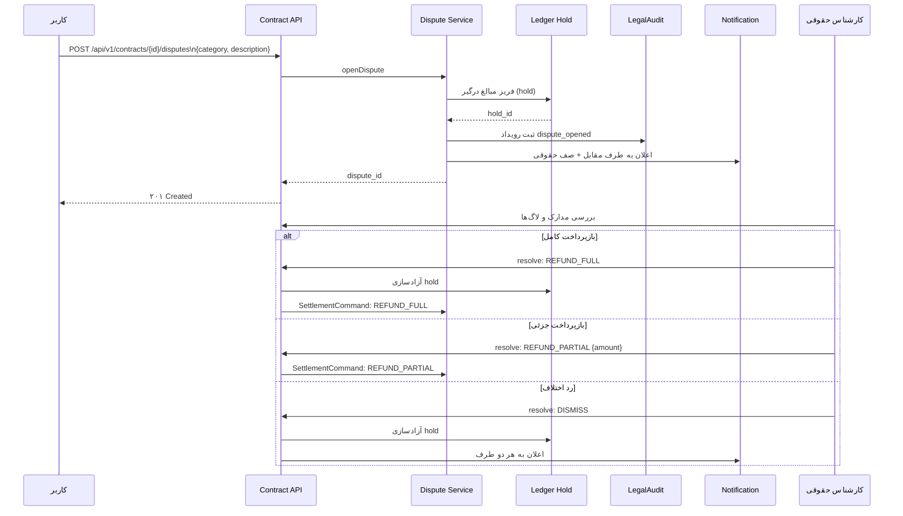

### ۱۰.۲ دسته‌بندی اختلافات

| نوع | کد | توضیح |
|------|-----|--------|
| اختلاف پرداختی | `payment` | عدم پرداخت / پرداخت اشتباه |
| اختلاف امضا | `signature` | اعتراض به امضا |
| اختلاف سامانه رهگیری | `registry` | خطا یا تأخیر در کد رهگیری |
| اختلاف حقوقی | `legal` | مشکل در محتوای قرارداد |
| سایر | `other` | موارد متفرقه |

---

## 🔒 بخش ۱۱: امنیت، ممیزی و رصدپذیری

### ۱۱.۱ لایه‌های امنیت

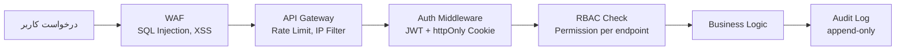

### ۱۱.۲ جدول audit_events

| فیلد | نوع | توضیح |
|------|-----|--------|
| `event_id` | UUID | شناسه یکتا |
| `occurred_at` | timestamp | زمان وقوع |
| `actor_type` | enum | `user / system / psp / registry` |
| `actor_id` | UUID | شناسه عامل |
| `contract_id` | UUID? | قرارداد مرتبط |
| `party_id` | UUID? | طرف مرتبط |
| `action` | string | نوع عملیات |
| `ip_address` | inet | IP عامل |
| `user_agent` | text | مرورگر/اپ |
| `device_hash` | string | fingerprint دستگاه |
| `request_id` | UUID | برای tracing |
| `prev_hash` | string | زنجیره hash |
| `event_hash` | string | hash این رویداد |

### ۱۱.۳ متریک‌های کلیدی

| متریک | توضیح |
|--------|--------|
| `contract_state_total{state}` | تعداد قراردادها در هر وضعیت |
| `payment_intent_success_total` | تراکنش‌های پرداخت موفق |
| `otp_rate_limited_total` | تعداد قفل‌های OTP |
| `dispute_open_total` | اختلافات فعال |
| `settlement_command_duration_seconds` | زمان پردازش تسویه |
| `fraud_score_high_total` | قراردادهای با ریسک بالا |

### ۱۱.۴ پشته رصدپذیری (Observability)

```
Grafana ──── Prometheus (متریک‌ها)
         └── Loki (لاگ‌های ساخت‌یافته JSON)
         └── Tempo (Distributed Tracing)
                │
                └── OpenTelemetry Collector
                        │
                        ├── backend/backend (FastAPI)
                        └── ml-pricing service
```

---

## 📊 بخش ۱۲: نقشه راه پیاده‌سازی

### ۱۲.۱ اولویت‌بندی اجرایی

| اولویت | حوزه | شرح | وضعیت |
|--------|------|------|--------|
| **P0** | State Machine + SLA | State transition کامل + SLA scheduler | در پیشرفت |
| **P0** | Ledger idempotent | append-only + reversal_of_entry_id | در پیشرفت |
| **P1** | Dispute + Hold | سیستم اختلاف + فریز مبالغ | نیاز به پیاده‌سازی |
| **P1** | Audit حقوقی | export دادگاه + hash chain | بخشی انجام شده |
| **P2** | Settlement Engine | بازپرداخت / reversal کامل | نیاز به پیاده‌سازی |
| **P2** | Versioning قرارداد | نسخه‌گذاری + diff نمایشی | نیاز به پیاده‌سازی |
| **P3** | Referral + Fraud | پاداش دعوت + سیگنال‌های کلاهبرداری | نیاز به پیاده‌سازی |

### ۱۲.۲ Sprint Planning پیشنهادی

```mermaid
gantt
  title نقشه راه پیاده‌سازی Amline
  dateFormat YYYY-MM-DD
  section زیرساخت
    Staging + DB واقعی       :done, s1, 2025-01-01, 7d
    State Machine کامل       :active, s2, after s1, 7d
    Ledger idempotent         :s3, after s2, 5d
  section قرارداد
    رهن/اجاره کامل            :done, c1, 2025-01-01, 7d
    خرید/فروش                 :done, c2, after c1, 7d
    سایر انواع قرارداد        :c3, after c2, 10d
  section امنیت
    OTP production + RBAC     :active, sec1, 2025-01-01, 7d
    Dispute + Hold            :sec2, after sec1, 7d
    Settlement Engine         :sec3, after sec2, 5d
  section رصدپذیری
    Observability Stack        :done, obs1, 2025-01-01, 5d
    Alerting Rules             :obs2, after obs1, 3d
```

### ۱۲.۳ استراتژی مهاجرت (Strangler Fig)

| گام | بازه | کار | معیار موفقیت |
|------|------|-----|--------------|
| ۰ | هفته ۱ | استقرار Gateway جلوی همه دامنه‌ها | همه ترافیک از Gateway |
| ۱ | هفته ۲–۳ | Contract Service جدید در staging | API جدید پاسخ می‌دهد |
| ۲ | هفته ۴ | ۱٪ ترافیک به سرویس جدید | خطای صفر |
| ۳ | هفته ۵ | رهن/اجاره با feature flag | فقط کاربران خاص |
| ۴ | هفته ۶–۷ | ۱۰۰٪ ترافیک رهن/اجاره | بدون خطا |
| ۵ | هفته ۸–۱۲ | اضافه کردن سایر انواع قرارداد | هر نوع جداگانه |
| ۶ | هفته ۱۳ | حذف کد قدیمی | — |

> **Fallback:** در هر مرحله، اگر سرویس جدید ۵۰۰ داد، Gateway درخواست را به سیستم قدیم هدایت می‌کند.

---

## 📌 ضمیمه الف — مدل داده کامل (ERD خلاصه)

```
users ─────────── contracts ────────── parties
  │                    │                  │
  │              contract_terms     signatures
  │                    │
  │              commissions ────── payment_intents
  │                    │                  │
  │              financial_ledger_entries │
  │                    │                  │
  │              disputes ─────── dispute_evidence
  │                    │
  │              ledger_holds
  │
  ├── audit_log_entries
  ├── rbac_roles
  └── crm_leads ─── crm_activities
```

---

## 📌 ضمیمه ب — خلاصه API‌های کلیدی

| عملیات | متد | مسیر |
|---------|------|------|
| ایجاد قرارداد | POST | `/api/v1/contracts/start` |
| جزئیات قرارداد | GET | `/api/v1/contracts/{id}` |
| به‌روزرسانی شرایط | PATCH | `/api/v1/contracts/{id}/terms` |
| درخواست OTP امضا | POST | `/api/v1/contracts/{id}/otp/send` |
| تأیید OTP امضا | POST | `/api/v1/contracts/{id}/otp/verify` |
| امضای مستقل (S1) | POST | `/api/v1/contracts/{id}/sign` |
| درخواست امضای کاتب (S2) | POST | `/api/v1/contracts/{id}/sign/agent/request` |
| تأیید امضای کاتب | POST | `/api/v1/contracts/{id}/sign/agent/verify` |
| درخواست S4 ادمین | POST | `/api/v1/contracts/{id}/sign/admin-assist/request` |
| تأیید S4 ادمین | POST | `/api/v1/contracts/{id}/sign/admin-assist/verify` |
| ایجاد اختلاف | POST | `/api/v1/contracts/{id}/disputes` |
| کمیسیون | POST | `/api/v1/contracts/{id}/commissions` |
| پرداخت توکیلی P2 درخواست | POST | `/api/v1/contracts/{id}/commissions/{cid}/delegate-pay/request` |
| پرداخت توکیلی P2 تأیید | POST | `/api/v1/contracts/{id}/commissions/{cid}/delegate-pay/verify` |
| تأیید حقوقی | POST | `/api/v1/legal/reviews/{id}/decide` |

---

## 📌 ضمیمه ج — شکل یکدست خطا

همه APIها از ساختار `ErrorResponse` استفاده می‌کنند:

```json
{
  "error": {
    "code": "CONTRACT_NOT_FOUND",
    "message": "قرارداد یافت نشد.",
    "details": { "contract_id": "..." },
    "request_id": "550e8400-e29b-41d4-a716-446655440000"
  },
  "request_id": "550e8400-e29b-41d4-a716-446655440000"
}
```

**کدهای خطای کلیدی:**

| کد خطا | HTTP | توضیح |
|--------|------|--------|
| `VALIDATION_FAILED` | 422 | اعتبارسنجی Pydantic |
| `CONTRACT_NOT_FOUND` | 404 | قرارداد پیدا نشد |
| `OTP_INVALID_OR_EXPIRED` | 400 | OTP اشتباه یا منقضی |
| `OTP_RATE_LIMITED` | 429 | تعداد تلاش زیاد |
| `UNAUTHORIZED` | 401 | احراز هویت لازم |
| `FORBIDDEN` | 403 | دسترسی مجاز نیست |
| `CONTRACT_ALREADY_SIGNED` | 409 | قرارداد قبلاً امضا شده |
| `INTERNAL_ERROR` | 500 | خطای داخلی سرور |

---

*پایان سند جامع پلتفرم Amline — نسخه ۱.۰*  
*مرجع اصلی: [`docs/AMLINE_MASTER_SPEC.md`](../docs/AMLINE_MASTER_SPEC.md)*
